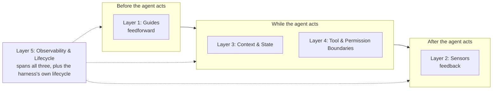

# Five Control Layers

The five control layers form the backbone of a repository harness. Each layer addresses a different failure mode and operates at a different point in the agent lifecycle.

For concrete prompts and end-to-end implementation examples, see [Build Your Harness](07-Build-Your-Harness.md).

---

- [Layer 1: Guides (Feedforward Control - acting before the agent runs)](#layer-1-guides-feedforward-control---acting-before-the-agent-runs)
- [Layer 2: Sensors (Feedback Control - acting after the agent has run)](#layer-2-sensors-feedback-control---acting-after-the-agent-has-run)
- [Layer 3: Context & State Management](#layer-3-context--state-management)
- [Layer 4: Tool & Permission Boundaries](#layer-4-tool--permission-boundaries)
- [Layer 5: Observability & Lifecycle Controls](#layer-5-observability--lifecycle-controls)
- [How the Layers Work Together](#how-the-layers-work-together)

---

## Layer 1: Guides (Feedforward Control - acting before the agent runs)

### What This Layer Addresses

Guides are repository-local, versioned documents that define expected behavior **before** the agent runs. They encode the team's standards, constraints, and architectural decisions in a form that agents can read and humans can maintain.

Guides reduce reliance on prompting by making expectations explicit and durable in the codebase.

### Key Mechanism Examples

**[`AGENTS.md`](https://agents.md) — Operational Context**
- Root repository document defining all agents' responsibilities
- Optional module-level documents that refine or extend the root
- Supports progressive discovery: read root first, then nearest module file as the agent moves down folders
- Keep each file short to limit context pollution — see [chapter 04: Progressive Discovery](04-Harness-Components.md#progressive-discovery-the-pattern-every-harness-file-follows) for line budgets and the override mechanism when using the harness skills
- Establishes operational invariants, known footguns, and internal boundaries (with hard non-negotiables extracted to `INVARIANTS.md` when needed)

**[`Skills`](https://agentskills.io/) — Capability & Method Contract**
- A repository can define multiple skills, each with its own `SKILL.md` (typically under a skills directory such as `.agents/skills/`).
- A skill is a **Layer 1 document** — read upfront, feedforward — whose content defines the agent's permitted action space. The SKILL.md file itself lives in Layer 1 because its mechanism is documentation: the agent reads what it may do before acting. The permissions it describes are *enforced* by Layer 4 mechanisms (Makefile restrictions, runtime tool controls); the skill is the declaration, Layer 4 is the enforcement.
- Lists what the agent **can** do in this repo (read and analyze code, propose changes, run tests, etc.)
- Explains **how** to do each skill (which directories, which commands, which tools are available)
- Separates capability declaration from operational context (that lives in `AGENTS.md`) and hard restrictions (that live in `INVARIANTS.md`)

**`INVARIANTS.md` — Architecture & Safety Constraints**
- Domain-specific rules ("PII must never appear in logs")
- Coding standards ("All API responses must use OpenAPI v3.x contracts")
- Integration constraints ("Agents cannot directly modify production databases")

### Considerations When Implementing This Layer

**Portable Across Models and Tools**: Write guides in the canonical locations (`AGENTS.md`, `.agents/skills/`) — not in tool-specific directories (`.claude/`, `.cursor/`, `.github/`). The full portability argument is in [Harness Components §1](04-Harness-Components.md#1-agentsmd---operational-context).

**Declarative, Not Instructional**
Write "what must be true" and "what must never happen," not "here's how to make the model do X." The agent should infer the method from constraints.

**Stable Across Repo Lifetime**
Guides can be refined, but they should not require constant rewriting as models or code evolves. If your AGENTS.md is constantly outdated, the problem is your update process—guides should capture durable constraints, not implementation details that change frequently.

### Why This Layer Matters

Guides move the workflow from **"prompt until it works"** to **"design the conditions under which it cannot easily fail."**

They are your first line of defense. In our experience, agents that read explicit, durable constraints tend to respect them more consistently than agents relying on prompt instructions alone — but this is a probabilistic lever, not a guarantee. The empirical picture is mixed: LLM-generated context files can actually *reduce* task success, and even human-written ones help inconsistently across models (see the [research in READING.md](READING.md#counterpoints-and-critical-perspectives)). The lever is quality and restraint — constraints the codebase cannot infer on its own, kept lean — not volume.

---

## Layer 2: Sensors (Feedback Control - acting after the agent has run)

### What This Layer Addresses

Sensors are automated checks that validate or reject agent output **after** the agent has run but **before** the output is accepted, merged, or deployed. They are your safety net.

Sensors operate in a feedback loop: agent produces output → sensors check → accept or reject → feedback to human or loop for retry.

### Key Mechanism Examples

**Tests and Linters**
- Unit tests on generated code
- Style/formatting checks
- Domain-specific validators ("does this code use the approved encryption library?")

**Schema and Contract Validation**
- JSON schema validation on structured outputs
- OpenAPI compliance checks on generated API endpoints
- Type checking on generated code

**Policy Checks**
- Security policy enforcement ("this code does not call unsafe system functions")
- Performance gates ("generated query does not do N+1 lookups")
- Compliance checks ("PII handling follows our privacy standards")

**"LLM as Judge" Loops**
- Using another model instance to evaluate agent output
- Example: agent generates code, second model checks if it correctly implements the spec
- Cost-effective for problems where judgment is domain-specific but hard to automate
- Reach for this when rule-based sensors can't capture what "correct" looks like — natural language quality, semantic accuracy, or intent alignment
- Note: this is an advanced pattern not covered in the step-by-step implementation guide; the foundational sensors (tests, linters, schema validation) in [Build Your Harness](07-Build-Your-Harness.md) are sufficient for most harnesses

### Considerations When Implementing This Layer

**Fail Fast, Fail Clear**
A sensor that catches most errors is far more useful than one so strict it generates false positives and gets disabled. Start with broad, obvious checks. Refine over time.

**Actionable Feedback**
When a sensor rejects output, provide the agent (or human) with a clear reason **why** and ideally what to fix. "Schema validation failed: expected 'type' field in response" is good. "Output rejected" is useless.

**Layered Severity**
Some sensor failures should block merging; others should just log warnings. Use a tiered system:
- **Critical** (hard block): Security policies, data contract violations
- **Important** (warnings + human gate): Code quality, style
- **Nice-to-have** (informational): Metrics, optimization suggestions

### Why This Layer Matters

Sensors catch errors before they propagate. In a system without sensors, a bad agent output might:
- Get committed to the main branch
- Be deployed to production
- Cause customer impact
- Be discovered during post-incident review

With sensors, the same output is caught immediately, and the problem is either fixed or escalated to a human for review.

This changes the cost profile of AI deployment: instead of "catch errors in production," you get "prevent errors from reaching production."

---

## Layer 3: Context & State Management

### What This Layer Addresses

Agents hallucinate. Context accumulates. Context windows are finite. Without explicit rules about what context is loaded, how it is pruned, and what persists across runs, agent outputs degrade over time.

This layer establishes the "ground truth" that keeps agent decisions accurate and consistent.

### Key Mechanism Examples

**Context Loading Rules**
- What information is automatically included in every prompt
- What information is retrieved on-demand based on the task
- What information is explicitly excluded (e.g., other agents' task descriptions)

**Context Pruning and Summarization**
- If retrieved context exceeds the token limit, how is it condensed?
- Which parts are most important? (Preserve constraints; summarize examples)
- Is context deduplicated across runs?

**State Persistence Rules**
- What is remembered across task runs? (e.g., "the list of files modified in this session")
- What is reset between runs? (e.g., "the intermediate reasoning steps")
- How is state versioned or rolled back?

**Hallucination Amplification Prevention**
- If an agent references something that might not exist, how is it verified?
- If an agent makes an assumption, how is it documented and checked?

Representative policy pattern:
- Load only high-value context (README, root/nearest `AGENTS.md`, relevant decisions)
- Prune aggressively when limits are reached (keep constraints, drop low-value examples)
- Persist execution-critical state across retries (changed files, decisions made)
- Verify uncertain claims against source files before acting

### Why This Layer Matters

This layer prevents **context rot**: the slow degradation of agent output quality as models accumulate stale or contradictory information. (Progressive discovery — reading the nearest `AGENTS.md` as the agent traverses subdirectories — is the Layer 1 mechanism that feeds well-scoped context into this layer.)

Without explicit context rules, you get:
- Agents making decisions based on outdated documentation
- Hallucination feedback loops ("the model thinks something is true because it has said it before")
- Forgotten constraints (because they fell out of the context window)
- Inconsistent behavior across identical tasks run at different times

With explicit context rules, you get determinism and auditability: you can explain which information led to a specific decision.

**Implementation scope**: Context loading and pruning rules are partly an engineering-time concern — harness file size budgets, progressive discovery, and the token thresholds in [chapter 09](09-Keep-It-Current.md#context-budget) — and partly a runtime concern: in-session orchestration, token management at inference time, and state persistence across sessions. This guide covers the engineering-time half; for runtime context management patterns, see [READING.md](READING.md).

---

## Layer 4: Tool & Permission Boundaries

### What This Layer Addresses

An agent's actions are constrained by what tools it can call and what those tools will actually do. This layer defines the boundary between "what the agent is allowed to attempt" and "what the agent is allowed to execute."

Skills declare the allowed action surface (a Layer 1 artifact — see above); the Makefile and runtime tool configuration in this layer are what actually **enforce** it. Both must stay consistent: Layer 1 declares, Layer 4 enforces.

In our experience, undefined or poorly enforced tool boundaries are a common source of agent failures.

### Key Mechanism Examples

**Single Execution Surface (Makefile pattern)**

The foundational engineering-time anchor for this layer: agents run only commands exposed via one named target list — typically a `Makefile` (also `justfile`, `Taskfile.yml`). The hard rule is encoded as a top-of-file comment: `# Agents: run only make targets listed here. No direct shell commands.` Primary validation conventionally lives at `make check` (lint + typecheck + test).

This provides:
- **Discoverability**: `make help` shows the full agent-allowed action set
- **Single control point**: add a target → both humans and agents see the new action; remove one → the agent's action set narrows immediately
- **Tooling-agnostic**: abstracts whether you use pytest, jest, ruff, or any other tool
- **Prevention of command hallucination**: the agent cannot invent commands the `Makefile` doesn't expose

**Tool Inventory and Specification**
- Explicit list of available tools (no tool hallucination)
- For each tool: inputs, outputs, side effects, and constraints
- Example tools: "file_read", "file_write", "run_tests", "submit_pr", "query_codebase"

**Input Validation and Sanitization**
- What inputs does each tool accept?
- What constraints are enforced? (file path cannot escape the repo, PR title must be < 200 chars, etc.)
- What does the tool do if given invalid input?

Example: "The `run_command` tool only accepts commands from an explicit list in the `Makefile`. Any other command is rejected with an error."

**Permission and Approval Gates**
- Which operations require human approval before execution?
- What triggers an approval request? (Modifying `docs/` directory, deploying to production, deleting files)
- What information does the human reviewer receive?

Example: "File deletions, API endpoint changes, and dependencies updates require human review before execution. Agent can stage the change but cannot commit it."

**Forbidden Operation List**
- What can the agent never do, regardless of how cleverly it tries?
- Example: "No direct database writes. No credential use without explicit approval. No modification of CI/CD configuration without security team review."

### Why This Layer Matters

Many agent failures occur not because the agent made a logical error, but because:
- It called a tool that doesn't exist (hallucination)
- It called a tool with invalid inputs
- It attempted something dangerous (deleting all files, modifying credentials)
- It bypassed guardrails by using direct system commands

By explicitly defining what the agent CAN do, you reduce a large class of failure modes.

**Soft vs. hard enforcement**: The Makefile comment (`# Agents: run only make targets listed here`) is soft enforcement — it establishes clear intent and is respected by agents that read their context, but it does not mechanically prevent a capable model from running direct shell commands. For engineering-time harness work, soft enforcement is usually the right level: the constraint is documented, violations are visible in diffs, and the harness is not the last line of defense. Hard enforcement — sandboxing, runtime tool restrictions, permission models — is a runtime infrastructure concern outside this guide's scope.

---

## Layer 5: Observability & Lifecycle Controls

### What This Layer Addresses

Agents consume resources (tokens, compute), can fail in subtle ways, and need to be operated — not just created. This layer makes agents and the harness around them visible and controllable.

This is the most stage-dependent of the five layers. **Engineering-time** concerns are about controlling what the harness *itself* costs the agent on every invocation — token budget for auto-loaded files, progressive discovery so the agent pays only for context the current task needs, maintenance cadence so the harness doesn't silently rot. **Runtime** concerns are about controlling the agent's *operations on live calls* — per-task cost ceilings, retry ceilings, health checks, abort conditions. This guide focuses on the engineering-time slice; runtime mechanisms appear here for completeness and are covered deeper in the runtime-focused material in [`READING.md`](READING.md).

### Key Mechanism Examples

**Token Budget for Auto-Loaded Content** *(engineering-time)*
- Files pulled into context before the first message — root `AGENTS.md`, `INVARIANTS.md`, the `CLAUDE.md` shim — must stay within a strict budget (working heuristic: ≤ 4,000 tokens total; see [chapter 09 Context Budget](09-Keep-It-Current.md#context-budget) for the basis, how to recalibrate, and the per-agent tokenizer caveat)
- Exceeding the budget signals that content has crept into root context that belongs in a skill or `docs/` file
- Measured explicitly by the full audit prompt in [chapter 09](09-Keep-It-Current.md)

**Progressive Discovery** *(engineering-time)*
- Small files, links instead of monoliths: nearest module-level `AGENTS.md` rather than one large root file; on-demand skills rather than auto-loaded ones; `docs/` referenced from `AGENTS.md` rather than inlined
- The agent pays only for the tokens needed for the current task, not every task
- Without this, a growing repo silently raises the per-invocation cost of every agent action

**Maintenance Cadence** *(engineering-time)*
- Regular health check (high cadence) or full audit (lower cadence) ([chapter 09](09-Keep-It-Current.md))
- Detects rot — broken references, stale commands, drift — before it silently misleads agents
- The harness itself has a lifecycle — see *Lifecycle States* below

**Runtime controls** *(runtime)*
Cost limits, retry ceilings, health checks, and abort conditions make agents operable in production. These are outside this guide's engineering-time scope — see [`READING.md`](READING.md) → *Foundations* for runtime-focused material that covers them in depth.

### Considerations When Implementing This Layer

**Observability != Logs**

Having logs is necessary but not sufficient at either stage:
- *Engineering-time*: an audit trail of harness changes (`CHANGELOG.md`, git history) and structured assessments tracked across runs via the `harness-inspect` full audit (see [chapter 09](09-Keep-It-Current.md))
- *Runtime*: **Metrics** (cost per task, success rate, latency), **Traces** (full visibility into agent steps), **Alerts** (automatic notification on failure), **Audit logs** (immutable record of agent actions, for compliance and debugging)

**Lifecycle States**

Two distinct lifecycles ride on this layer:
- *Engineering-time — the harness's lifecycle*: built ([chapter 07](07-Build-Your-Harness.md)) → migrated when partial ([chapter 08](08-Migrate-Your-Harness.md)) → maintained ([chapter 09](09-Keep-It-Current.md))
- *Runtime — the agent invocation's lifecycle*: **Idle** (waiting for work) → **Running** (executing) → **Succeeded** / **Failed** / **Paused** (human intervention). You should be able to query the state of any agent at any time.

### Why This Layer Matters

At **engineering-time**, this layer keeps the harness itself cheap and honest: whether it has grown too expensive to load, whether the agent can find what it needs without dragging everything along, and whether it has rotted since you last looked. At **runtime**, the same layer answers the operational questions — what an agent costs, why it failed, whether to run it now, and whether it did what you expected.

Without it at engineering-time, the harness silently degrades — files grow, references rot, every agent invocation pays a higher tax. Without it at runtime, agents work great until they don't, and when they fail you have no visibility into why. With this layer, both the harness and the agents that use it become systems you can operate, scale, and trust.

---

## How the Layers Work Together

The five layers are not independent; they work as a system:

1. **Guides** tell the agent what the system should do
2. **Sensors** verify the agent did it correctly
3. **Context & State** keep the agent grounded and consistent
4. **Tool & Permission Boundaries** restrict what can go wrong
5. **Observability & Lifecycle Controls** lets you see and fix problems

Each layer acts at a different point in the agent lifecycle:

A failure in any layer shows up in a specific way:
- **Guide failure**: Agent produces output that violates documented constraints
- **Sensor failure**: Agent output passes guides but fails sensors
- **Context failure**: Agent makes decisions based on stale or hallucinated information
- **Tool failure**: Agent attempts to use tools that don't exist or behaves unexpectedly
- **Observability failure**: System fails but no one knows until a customer reports it

A mature harness implements all five layers; guides and sensors are the usual starting point. [Chapter 04](04-Harness-Components.md) maps each to the concrete files that implement them.

---

**← Previous:** [What a Harness Is](02-What-a-Harness-Is.md) · **Next:** [Harness Components](04-Harness-Components.md)