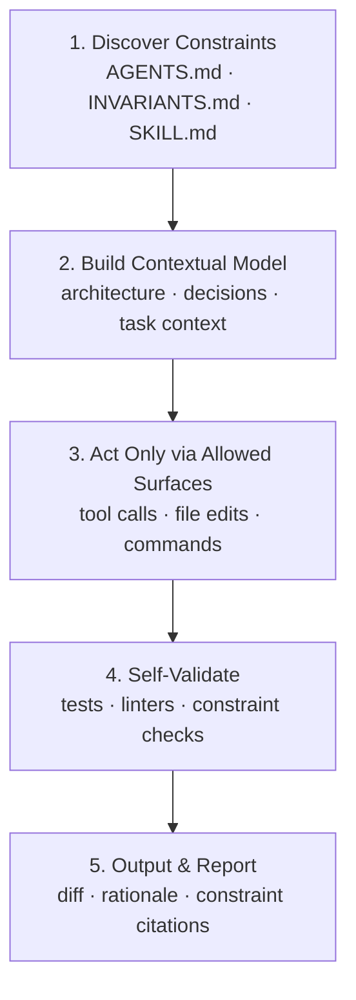
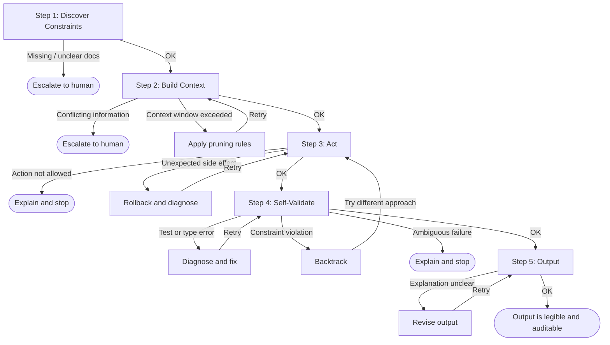
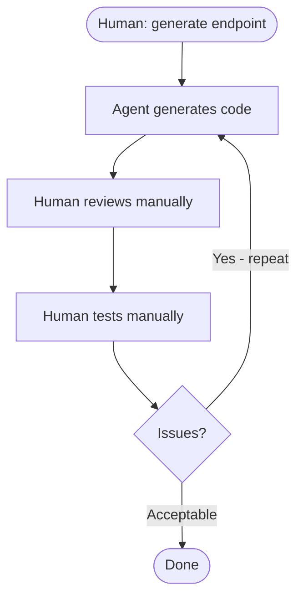
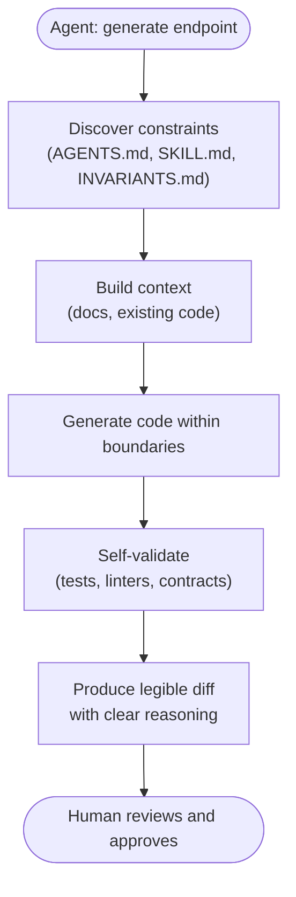

# How Agents Navigate

This document describes the **implicit loop** through which agents operate when embedded in a well-designed harness. This is not a hard specification—different teams will implement variations—but the pattern is consistent across harness implementations that follow the open standards. Because the loop is built on open standards (`AGENTS.md`, `INVARIANTS.md`, `.agents/skills/`), it is agent-agnostic: the same navigation pattern applies whether the agent is Claude, GitHub Copilot, Cursor, or any other tool implementing the specs.

---

- [The Five-Step Agent Loop](#the-five-step-agent-loop)
- [Looping on Failure](#looping-on-failure)
- [The Shift in Workflow](#the-shift-in-workflow)
- [Practical Example: Code Review Task](#practical-example-code-review-task)

---

## The Five-Step Agent Loop



Failures at any step trigger the decision tree in [Looping on Failure](#looping-on-failure) below.

### Step 1: Discover Constraints

**What happens:** Agent enters the repository and reads foundational documents.

**Documents read:**
- `AGENTS.md` (root) — Auto-loaded via tool-specific shim or native support; establishes repository-wide roles, footguns, and the link to `INVARIANTS.md`
- `INVARIANTS.md` — What absolutely cannot be changed?
- Relevant `SKILL.md` files — What can I do, and how do I do it for this task?
- Nearest module `AGENTS.md` (if present) — What local constraints apply here? (found via folder walk and navigation links)

**Key principle:** In a well-designed harness, the agent's behavior is driven by discovered rules rather than invented ones.

**Example:**
```
Agent starts CodeReview task
→ AGENTS.md auto-loaded: "CodeReviewer role: validate changes against architecture"
→ INVARIANTS.md linked from AGENTS.md: "All API changes require OpenAPI spec updates"
→ Reads relevant SKILL.md: "Can propose changes, but merge requires review"
→ Continues to Step 2 with constraints internalized
```

---

### Step 2: Build Contextual Model

**What happens:** Agent assembles the specific context needed for this task.

**Context sources:**
- Module-level `AGENTS.md` (if applicable) — Local constraints for this area of code; keep these files concise to avoid context pollution
- Architecture docs (`docs/ARCHITECTURE.md`) — How does this part of the system fit?
- Decision records (`docs/DECISIONS.md`, if linked from AGENTS.md) — Why were previous choices made this way?
- Task-specific context — The code being reviewed, the test results, the change being proposed

**Decision point:** Context pruning kicks in if the window fills. The engineering-time practices that manage this are harness file size budgets and progressive discovery (see [chapter 09](09-Keep-It-Current.md#context-budget)); specific in-session pruning logic is a runtime configuration concern outside this guide's scope.

**Key principle:** The agent builds a model **constrained by documented rules**, not free-form prompting.

**Example:**
```
Task: Review a new API endpoint proposal
→ Load docs/ARCHITECTURE.md (how APIs are structured here)
→ Load existing openapi.yaml (API contract standard)
→ Load the proposed code and test cases
→ Load previous API review decisions from DECISIONS.md
→ Prune to fit token limit (keep all invariants, remove low-value examples)
→ Ready to analyze with full context about how things work here
```

---

### Step 3: Act Only Via Allowed Surfaces

**What happens:** Agent takes action, but only through permitted channels.

**Allowed surfaces:**
- Code modifications (within boundaries specified in AGENTS.md)
- Commands via `make` targets (no direct shell commands)
- Tool calls (pre-approved tools with pre-defined inputs/outputs)

**Validation:** Each action is checked against tool & permission boundaries.
- Is this tool in the allowed list?
- Are the inputs valid and safe?
- Does this operation require human approval? (If yes, agent stops and asks)

**Key principle:** A well-designed harness makes it significantly harder for an agent to invent new actions or bypass guardrails. The Makefile comment is soft enforcement — see [Layer 4](03-Five-Control-Layers.md#layer-4-tool--permission-boundaries) for the distinction between soft and hard enforcement.

**Example:**
```
Agent proposes: "I'll modify the schema and run make test"
→ Check: Is "modify schema" allowed? YES (in src/ directory)
→ Check: Is "make test" allowed? YES (it's in Makefile)
→ Execute: Modify file, run make test
→ Next: If test passes, proceed to Step 4; if fails, diagnose and retry

Agent proposes: "I'll update the CI/CD config"
→ Check: Is this allowed? NO (INVARIANTS.md forbids it without approval)
→ Action: Agent stops, explains why it's stopping, escalates to human
```

---

### Step 4: Self-Validate

**What happens:** Agent runs automated checks on its output **before** declaring success.

**Checks performed:**
- **Tests**: `make test` passes
- **Linters/formatters**: `make lint` and `make format` pass
- **Type checks**: `make typecheck` passes
- **Schema validation**: Generated API responses match openapi.yaml
- **Policy checks**: Custom sensors (security, performance, compliance)

**Convenience target:** Most repositories provide `make check` to run all critical sensors at once.

**What if checks fail?**
- If failure is clear (e.g., test failure), agent diagnoses and retries
- If failure is ambiguous, agent explains the failure to a human and stops
- If check indicates a constraint violation, agent backtracks and tries a different approach

**Key principle:** Agent validation happens before human review, reducing review burden.

**Example:**
```
Agent runs: make check
→ Tests: PASS
→ Lint: 3 style issues found
→ Agent auto-fixes with: make format
→ Lint again: PASS
→ Type check: PASS
→ Result: All checks pass
→ Proceed to Step 5

Alternative:
Agent runs: make check
→ Tests: FAIL (test_api_contract failed)
→ Agent reads test output: "Expected 'type' field in response"
→ Agent reviews code: Field was missing from schema
→ Agent adds field and re-runs make check
→ Tests: PASS
→ Proceed to Step 5
```

---

### Step 5: Produce Legible Output

**What happens:** Agent generates output that is easy for humans to review and understand.

**Output characteristics:**

**Small diffs:** Changes are focused and easy to review.
- Don't make 3 unrelated changes in one PR; make 3 separate PRs
- If possible, break large changes into reviewable chunks

**Explicit reasoning:** Commit messages and PR descriptions clearly explain why.
```
Example commit message:
Bad:  "Fix API"
Good: "Add 'type' field to UserResponse schema per OpenAPI 3.0 spec"

Example PR description:
Bad:  "Changes to payment logic"
Good: "Refactor payment retry logic:
  - Changed retry backoff from linear to exponential
  - Reason: Reduces server load during outages (per incident ADR-2024-005)
  - Testing: Added 3 new test cases for edge cases
  - Risk: Backwards compatible; existing payments unaffected"
```

**Citation of constraints:** If something was rejected or changed due to a constraint, say so explicitly.
```
"This change was modified to comply with INVARIANTS.md#no-direct-db-writes
 (all DB changes must go through migrations). Updated to use new migration
 framework instead."
```

**Key principle:** Output is auditable and maintainable, not just correct.

**Example:**
```
Agent output:

COMMIT: "Add OpenAPI spec validation to API integration tests"
- Added schema validation for POST /users endpoint
- Tests now enforce request/response contracts match openapi.yaml
- Reason: Prevents drift between spec and implementation (INVARIANTS.md)

CHANGES: 1 file changed, 15 lines added
- tests/test_api_contracts.py (new validation)

VALIDATION: make check ✓
- Tests pass
- Linters pass
- Type checks pass

HUMAN REVIEW: Ready for merge (no approvals required for test additions)
```

---

## Looping on Failure

If any step fails, the agent has a decision tree:



**Key principle:** At each step, failure is a signal, not a termination. The agent has options:
1. **Auto-fix and retry** (if the solution is clear)
2. **Diagnose and explain** (if requiring human intervention)
3. **Escalate** (if beyond agent authority)

---

## The Shift in Workflow

### Old workflow (Ad-hoc prompting):



**Problem:** Every error requires human intervention and context-switching.

### New workflow (with a repository harness):



**Advantage:** Human review becomes lightweight; validation is automated; context is explicit.

---

## Practical Example: Code Review Task

The CodeReview example threaded through Steps 1–5 above *is* this walkthrough — discover constraints, build context, act only via allowed surfaces, self-validate, produce legible output. For full, prompt-driven implementation examples, see [Build Your Harness](07-Build-Your-Harness.md) (Phase 5 validation prompts).

This workflow keeps roles clear: agents handle context and validation; humans handle judgment and approval. Chapter 06 shows what this pattern looks like applied across a full reference repository layout.

---

**← Previous:** [Harness Components](04-Harness-Components.md) · **Next:** [Reference Layout](06-Reference-Layout.md)