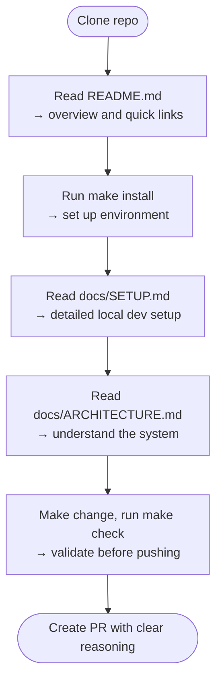
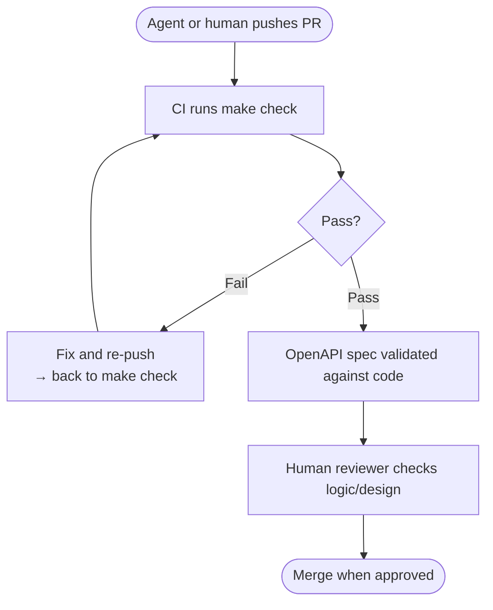

# Reference Layout

This document shows a production-grade repository structure that incorporates all harness components. Use this as a reference for your own implementation.

## Complete Repository Structure

```
my-service/
├── README.md                    # Human entry point
├── .agents/
│   └── skills/                  # Optional; create per recurring task type only
│       ├── code-review/
│       │   └── SKILL.md         # Per-skill capability + method contract
│       └── api-design/
│           └── SKILL.md
├── AGENTS.md                    # Repository invariants and roles (root; mandatory)
├── INVARIANTS.md                # Non-negotiable constraints
├── Makefile                     # Single execution surface
│
├── src/                         # Application code
│   ├── __init__.py
│   ├── main.py
│   ├── api/
│   │   ├── __init__.py
│   │   ├── AGENTS.md            # Module-level constraints (optional; keep concise)
│   │   ├── handlers.py
│   │   └── routes.py
│   ├── services/
│   │   ├── __init__.py
│   │   ├── payment.py
│   │   └── auth.py
│   └── models/
│       ├── __init__.py
│       └── user.py
│
├── tests/                       # Test suite
│   ├── __init__.py
│   ├── test_api.py
│   ├── test_services.py
│   ├── fixtures/
│   └── integration/
│
├── docs/                        # Design authority
│   ├── ARCHITECTURE.md          # System design
│   ├── DECISIONS.md             # ADRs and decision history
│   ├── SETUP.md                 # Local dev environment
│   ├── CONTRIBUTING.md          # How to contribute
│   ├── SECURITY.md              # Security policies
│   ├── API.md                   # API reference (or link to OpenAPI)
│   └── TESTING.md               # Testing strategy
│
├── openapi.yaml                 # OpenAPI 3.x contract (if service)
├── pyproject.toml               # Python project config
├── requirements.txt             # Dependencies
├── .editorconfig                # Cross-tool editor settings
├── .ruff.toml                   # Linter config
├── .gitignore                   # Git ignore rules
└── .agentignore                 # Agent ignore rules (optional)
```

---

## File-by-File Breakdown

> **Note**: This section shows the structure and key content types. For complete, step-by-step creation guidance with discovery prompts and full examples, see **[Build Your Harness](07-Build-Your-Harness.md)**.

### Root-Level Files

#### README.md
**Purpose**: Human entry point — description, quickstart, and links to deeper resources
**Key content**: One-paragraph description, minimal quickstart commands, links to harness files and docs, external references (wiki, Jira, API specs)
**See**: [Build Your Harness](07-Build-Your-Harness.md) for full creation guide

#### Skills (`SKILL.md` per skill, Optional)
**Purpose**: Encode agent capabilities in Metadata + Instructions + Resources format
**Location**: `.agents/skills/{skill-name}/SKILL.md`
**Key content**: Metadata (name, description), instructions, resources (files/commands)
**See**: [Build Your Harness §2.5](07-Build-Your-Harness.md) for full creation guide and examples

#### AGENTS.md (Root)
**Purpose**: Repository-wide operational context, roles, and known hazards
**Key content**:  
- Repository overview and prose component summary, with a forward link to docs/ARCHITECTURE.md
- Link to INVARIANTS.md at the top (blockquote, read-first instruction)
- Agent authorization (Authority, Escalation per role)
- Known footguns (local hazards and how to avoid them)
- Architecture decision links

**Key principle**: Keep concise (< 5 min read); link to INVARIANTS.md for hard constraints; link to docs/ for deeper context
**See**: [Build Your Harness §2.1](07-Build-Your-Harness.md) for full creation guide

#### Module-Level AGENTS.md (Optional)
**Purpose**: Refine repository-wide rules for a specific subtree
**Location**: `src/{module}/AGENTS.md` (e.g., `src/api/AGENTS.md`)
**Key content**: Scope, local context, local rules, local footguns, navigation links to parent/children
**Key principle**: Inherit root constraints; can only extend or tighten, never contradict
**See**: [Build Your Harness §2.2](07-Build-Your-Harness.md) for full creation guide

#### INVARIANTS.md
**Purpose**: Canonical list of hard, non-negotiable constraints
**Key sections**: Security, Performance, Backwards Compatibility, API Contract, Testing, Data Integrity, Code Quality
**Key principle**: Canonical source for constraints; AGENTS.md links here rather than duplicating
**See**: [Build Your Harness §2.3](07-Build-Your-Harness.md) for full creation guide

#### Makefile
**Purpose**: Unified execution surface; replaces tribal knowledge of "how to build/test/lint"
**Key targets**: `install`, `build`, `test`, `lint`, `format`, `typecheck`, `check` (primary target), `clean`, `help`
**Key principle**: All validation should run via `make check`; gates all merges in CI
**Key principle**: Agents can only run commands exposed in Makefile (prevents hallucination)
**See**: [Build Your Harness §2.4](07-Build-Your-Harness.md) for full template and creation guidance

### docs/ Directory

#### docs/ARCHITECTURE.md
**Purpose**: System design at a level suitable for decision-making (not how-to implementation)
**Key sections**: System overview + diagram, data flow, key components, performance characteristics, security architecture, deployment model
**Key principle**: Architecture docs are the design authority — when code diverges, treat it as a signal to reconcile
**See**: [Build Your Harness §3.1](07-Build-Your-Harness.md) for full creation guide

#### docs/DECISIONS.md
**Purpose**: Architecture decision records explaining WHY the system looks like this
**Key content**: For each decision: Title, Date, Status, Context, Decision, Consequences, Agent guidance
**Key principle**: Decisions are linked from AGENTS.md; enables tracing "why did we do this?"
**See**: [Build Your Harness §3.2](07-Build-Your-Harness.md) for full creation guide

#### docs/CONTRIBUTING.md
**Purpose**: How to work in this repo — for human contributors only. Most agents do not read it; agent escalation policy belongs in `AGENTS.md`.
**Key content**:
- Code review expectations and what makes a good PR
- Required checks (`make check`, passing tests)
- Branch naming, commit style (e.g., [Conventional Commits](https://www.conventionalcommits.org/)), PR template
- Common tasks with links to relevant skills

**Key principle**: Keep it human-readable; do not duplicate agent constraints from `AGENTS.md` here  
**Location note**: `CONTRIBUTING.md` is canonical — GitHub recognises this location natively alongside the repo root and `.github/`, with no need to use the tool-specific directory
**See**: [Build Your Harness §3.5](07-Build-Your-Harness.md) for full creation guide

### Configuration Files

#### openapi.yaml
**Purpose**: Machine-verifiable API contract (source of truth for endpoints, schemas, responses)
**Key principle**: Code must match spec; if they diverge, one of them needs to be corrected
**See**: [Build Your Harness](07-Build-Your-Harness.md) for spec-first implementation guidance

#### .editorconfig
**Purpose**: Cross-tool editor settings (charset, line endings, indentation)
**Key principle**: Encode style; don't explain it

#### Linter & Formatter Config (.ruff.toml, .black, etc.)
**Purpose**: Code style enforcement (linting, formatting, import sorting)
**Key principle**: These are sensors; `make format` and `make lint` should enforce automatically
**See**: [Build Your Harness §2.4](07-Build-Your-Harness.md) for Makefile integration

---

## How This Repository Is Experienced

### First Time Agent Enters

An agent entering this layout follows the five-step navigation loop — discover constraints, build context, act only via allowed surfaces, self-validate, produce legible output. That path is covered in full in [How Agents Navigate](05-How-Agents-Navigate.md#the-five-step-agent-loop); it is not repeated here.

### Human Contributor Onboarding



### Code Review Process



---

## This Structure Covers Layers 1–4 Fully, Layer 5 Partially

This layout implements the Guides, Sensors, and Context layers fully. The Makefile and `INVARIANTS.md` give Layer 4 (Tool & Permission Boundaries) soft enforcement — see [Five Control Layers](03-Five-Control-Layers.md#layer-4-tool--permission-boundaries) for the soft-vs-hard distinction. To reach full production readiness, wire up the remaining pieces:
- ✅ Deploy with documented, soft-enforced constraints
- ✅ Scale to multiple contributors (standards are documented)
- ✅ Debug issues (decisions are auditable)
- ✅ Onboard agents (constraints are machine-readable)
- ✅ Evolve over time (decisions remain visible)
- ✅ Track engineering-time observability (`CHANGELOG.md`, `harness-inspect` audits)
- ⏳ Hard tool enforcement (sandboxing, runtime restrictions) — a runtime concern: see [Five Control Layers](03-Five-Control-Layers.md#layer-4-tool--permission-boundaries)
- ⏳ Runtime observability — cost limits, alerts, live health checks (Layer 5): see [Five Control Layers](03-Five-Control-Layers.md#layer-5-observability--lifecycle-controls)

---

## Ready to Build This?

This layout is a **reference example**. To build one for your own repository, follow the **step-by-step implementation guide**:

→ See **[Build Your Harness](07-Build-Your-Harness.md)** for:
- Discovery prompts to analyze your repository
- Phase-by-phase creation workflow (5 phases)
- Ready-to-use prompts for building each component
- Validation checklist and end-to-end testing

---

**← Previous:** [How Agents Navigate](05-How-Agents-Navigate.md) · **Next:** [Build Your Harness](07-Build-Your-Harness.md)