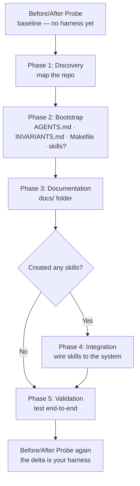

# Build Your Harness

This guide walks engineers and AI agents through creating a harness together. It uses discovery-based prompts that help you understand your repository structure, identify constraints, and build harness components iteratively.

**Scope**: This guide fully covers Layers 1–3 (Guides, Sensors, Context management) and partially covers Layer 4 (Makefile safe-set restriction and INVARIANTS.md constraints) and Layer 5 (structured, searchable logs). Hard tool enforcement and runtime observability are covered in depth in [Five Control Layers](03-Five-Control-Layers.md).

**Time to complete**: Varies significantly by repo size, codebase maturity, and the model you use. Phase 1 discovery and the documentation steps (especially the DECISIONS.md dialogue) take real time on any non-trivial codebase. Plan for a focused half-day minimum; larger or less-documented repos will take longer.

> **Already have harness-like files?** If your repository already has harness artifacts — a `CLAUDE.md`, scattered rules, an ad-hoc `Makefile`, or module notes — [Migrate Your Harness](08-Migrate-Your-Harness.md) is the better conceptual starting point. The `harness-setup` skill handles both starting points in a single flow.

> **Companion skill**: This chapter pairs with the [`harness-setup` skill](skills/harness-setup/SKILL.md). Every phase prompt referenced below lives in the skill's `references/` folder — invoke as `/harness-setup` in any agent supporting the [Agent Skills spec](https://agentskills.io/specification). Per [`INVARIANTS.md`](https://github.com/adobe/ai-repo-harness-guide/blob/main/INVARIANTS.md), prompts live only in the skill; this chapter is the conceptual companion.

---

- [Overview: The Implementation Journey](#overview-the-implementation-journey)
- [Phase 1: Discovery — Understanding Your Repository](#phase-1-discovery---understanding-your-repository)
- [Phase 2: Bootstrap — Create Core Harness Files](#phase-2-bootstrap---create-core-harness-files)
- [Phase 3: Documentation — Build docs/ Folder](#phase-3-documentation---build-docs-folder)
- [Phase 4: Integration — Connect Skills to System](#phase-4-integration---connect-skills-to-system)
- [Phase 5: Validation — Test the Harness End-to-End](#phase-5-validation---test-the-harness-end-to-end)
- [Putting It Together: Example Repository After Phase 5](#putting-it-together-example-repository-after-phase-5)
- [Validation Checklist: Is Your Harness Complete?](#validation-checklist-is-your-harness-complete)
- [Example End-to-End Workflow: Using Your Harness](#example-end-to-end-workflow-using-your-harness)
- [Going Further](#going-further)

---

## Overview: The Implementation Journey

Creating a harness is not a one-time overhaul. It follows a progression:

1. **Discovery Phase** — Understand your repo (language, frameworks, testing structure)
2. **Bootstrap Phase** — Create root AGENTS.md, module-level AGENTS.md files, Makefile, and any first Skills (optional)
3. **Documentation Phase** — Build docs/ folder with architecture and setup
4. **Integration Phase** — Connect any Skills you created to documentation and constraints (skip if you created none)
5. **Validation Phase** — Test the harness end-to-end with an agent



Each phase includes example prompts (for agents or engineers) that guide the discovery.

**Before starting**: run the [Before/After Probe](09-Keep-It-Current.md#beforeafter-probe) from Keep It Current to record how your agent behaves without a harness. Run it again after Phase 5 to see the difference.

---

## Phase 1: Discovery - Understanding Your Repository

**Goal**: Map out what you're working with before building constraints around it.

### 1.1 Repository Structure Discovery

The structure prompt asks the agent to inventory languages and frameworks, repository layout, testing structure, existing documentation, build and deployment, and any existing harness artifacts (so we extend rather than overwrite). Output is a structured checklist used as the starting point for everything that follows.

**Prompt**: [`.agents/skills/harness-setup/references/discovery.md`](skills/harness-setup/references/discovery.md) (Section 1.1).

**What this reveals:**
- Language determines which tools to encode in the Makefile
- Test structure shows where sensors already exist
- Existing docs show topics and scope — but identifiers in prose docs (env var names, route paths, queue names) are treated as unverified claims until confirmed against code
- Build system determines the Makefile interface
- Existing harness artifacts show what to extend vs. create from scratch

**Example output:**

<details>
<summary>Example output — click to expand</summary>

````
## Repository Analysis

### Language & Frameworks
- ✅ Primary: Python 3.11+
- ✅ Framework: FastAPI
- ✅ Key dependencies: 
   - FastAPI (web framework)
   - SQLAlchemy (ORM)
   - Pydantic (validation)
   - PyJWT (authentication)
   - pytest (testing)

### Repository Layout
- Entry point: src/main.py
- Structure:
   ```
   my-service/
   ├── src/
   │   ├── main.py
   │   ├── api/
   │   ├── models/
   │   └── services/
   ├── tests/
   ├── docs/
   ├── Dockerfile
   ├── pyproject.toml
   └── requirements.txt
   ```

### Testing
- Framework: pytest
- Location: tests/
- Coverage tool: pytest-cov
- Current coverage: ~72%
- Test types: Unit + integration tests in same directory

### Existing Documentation
- ✅ README.md (basic, 15 lines)
- ❌ No docs/ folder yet
- ❌ No ADRs
- ❌ No SETUP.md
- ❌ No CONTRIBUTING.md

### Build & Deployment
- Build: `python -m pip install -e .` (setuptools-based)
- No Makefile currently
- Deployment: Docker (single image)
- CI: GitHub Actions (basic test runner)
- Environments: dev (local), staging, prod
````

</details>

---

### 1.2 Constraint Discovery

The constraint prompt covers eight dimensions: reliability constraints (SLAs, critical paths, bottlenecks), security and compliance (PII, credentials, encryption, regulations), quality standards (coverage, linters, type checking), backwards compatibility, operational requirements (monitoring, rate limits, secret rotation, DR), documentation standards, existing automated enforcement (and gaps), and incident history (the richest source of real footguns).

**Prompt**: [`.agents/skills/harness-setup/references/discovery.md`](skills/harness-setup/references/discovery.md) (Section 1.2).

**What this reveals:**
- Hard constraints go into INVARIANTS.md
- Known footguns go into AGENTS.md (incident history is the richest source)
- Documentation needs shape the docs/ folder structure
- Tool requirements determine which sensors must pass
- Enforcement gaps (constraints not yet automated) become explicit TODO items in INVARIANTS.md

**Example output:**

<details>
<summary>Example output — click to expand</summary>

```
## Constraint Analysis

### Reliability
- SLA: p99 < 500ms for API endpoints
- Critical paths: Authentication, user profile fetch, subscription updates
- Known bottleneck: Database N+1 queries in user profile fetch
- Error rate: ~0.1% (5xx errors)

### Security & Compliance
- Sensitive data: User emails, hashed passwords, JWT tokens
- Credentials: Stored in GitHub Secrets for CI, .env locally, Vault in prod
- Encryption: HTTPS only in production; no at-rest encryption yet
- Compliance: GDPR (user data rights); no HIPAA/SOC2
- Auth: JWT bearer tokens for API; session cookies for web
- Audit logging: Minimal (only login events currently)

### Quality Standards
- Coverage target: >= 85% (currently 72%)
- Linting: None currently (opportunity!)
- Type checking: None (Python currently untyped)
- Static analysis: None
- Code review: GitHub PRs, but no formal requirements

### Backwards Compatibility
- Public API: YES (breaking changes need 6-month deprecation)
- Database: Migrations managed manually (no framework)
- Supported versions: Currently v1, v2 in development

### Operational
- Monitoring: Basic CloudWatch logs + alarms
- Rate limiting: None (but it's needed!)
- Feature flags: None currently
- Secret rotation: Manual (quarterly)
- DR: No formal plan; backup daily to S3

### Documentation
- API docs: OpenAPI spec (outdated, not enforced)
- Architectural docs: None (tribal knowledge only)
- ADRs: None
- Setup docs: Implicit (no SETUP.md)
```

</details>

---

## Phase 2: Bootstrap - Create Core Harness Files

**Goal**: Create the foundational files that make your repository a harness.

The bootstrap prompts default to **section-by-section dialogue**: for each section, the agent states what evidence it found and what it intends to write, then waits for confirmation before proceeding. For sections the codebase can't answer — team policy, incident history, operational agreements — the agent asks rather than filling in a default. See `references/bootstrap.md` for the full interaction pattern and the opt-in one-shot mode.

### 2.1 Create Root AGENTS.md

This is the centerpiece. It documents:
- Your service's purpose and a prose component overview (the diagram lives in `docs/ARCHITECTURE.md`)
- A read-first link to `INVARIANTS.md` for non-negotiable constraints (no inline summary)
- Known footguns (hazards)

The prompt builds an `AGENTS.md` with four sections: **Repository Overview** (prose component description; no diagram — that lives in `docs/ARCHITECTURE.md`), **Module Context** (links to module-level files, filled in during step 2.2), **Agent Authorization**, and **Known Footguns** (from Phase 1/2 incident history, each linking into `docs/DECISIONS.md`). Hard constraints live in `INVARIANTS.md`, referenced via the blockquote at the top — not summarised inline. Target: under 200 lines.

The **Agent Authorization** section requires team input that cannot be inferred from code: before drafting authority and escalation fields, the agent asks "What is your team's policy on agent-driven commits, merges, and approvals?" A wrong authority model propagates into every agent interaction; a placeholder is safer than a confident wrong default.

**Prompt**: [`.agents/skills/harness-setup/references/agents.md`](skills/harness-setup/references/agents.md) (*Root AGENTS.md* section).

**Example output:**

<details>
<summary>Example output — click to expand</summary>

````markdown
# AGENTS.md — Repository Constraints & Architecture

## Repository Overview

**MyService** handles user authentication and profile management for all company products.
High-scale, security-critical service used by millions of users daily.

Main components: HTTP/API layer (FastAPI), Auth Service, User Service, Audit Logging, and PostgreSQL (row-level security per tenant). See [docs/ARCHITECTURE.md](docs/ARCHITECTURE.md) for the full component diagram.

## Module Context

- [src/api/AGENTS.md](src/api/AGENTS.md) — API routes and contract rules
- [src/services/AGENTS.md](src/services/AGENTS.md) — Business logic and data access rules

## Agent Authorization

### CodeReviewer
- Authority: can comment, request changes, and approve non-security PRs
- Escalation: security changes, breaking API changes, schema migrations → human review required

### FeatureImplementer
- Authority: can commit to feature branches; cannot merge without CI passing and human approval
- Escalation: any change touching auth, data model, or public API → human review required

## Known Footguns

These are tricky areas where agents and engineers commonly make mistakes.

### User Profile Fetch Performance (N+1 Query Bug)
**What**: Fetching a user's profile runs 1 base query + N queries for related data (subscriptions, preferences).
Currently: ~300ms for 20 related items.

**Why**: Legacy ORM usage; should use eager loading or batch queries.

**What to Watch**:
- ✅ DO NOT fetch user profiles in a loop (worse N+M complexity)
- ✅ DO use `.with_related()` or batch fetch when needed
- ✅ DO add test that asserts query count before and after change
- ❌ DO NOT "optimize" without benchmarking (might move to different bottleneck)

See docs/DECISIONS.md#adr-2024-001-profile-fetch-optimization.

### No Audit Logging (Yet)
**What**: Data modifications are not logged. Cannot trace who changed what when.

**Why**: Added later as post-MVP feature; now a compliance gap.

**What to Watch**:
- ✅ DO add audit log entry for sensitive writes (password change, permission grant)
- ✅ DO NOT add logging to every write (performance impact)
- ❌ DO NOT disable audit requirements due to performance concerns (must design around it)

See docs/DECISIONS.md#adr-2024-002-audit-logging-roadmap.

### JWT Token Expiration Inconsistency
**What**: Tokens issued before Jan 2025 have 24-hour expiry; tokens after have 1-hour expiry.
Causes: ~3% of users to mysteriously get logged out after 1 hour if they have both tokens.

**Why**: Migration in progress; old system supported 24h, new system is 1h. Both must coexist.

**What to Watch**:
- ✅ DO handle both expiry times in validation logic
- ✅ DO test with both token types
- ✅ DO NOT shorten old tokens (breaks active sessions)
- ✅ DO NOT lengthen new tokens (increases security risk)

See docs/DECISIONS.md#adr-2024-003-token-expiry-migration.
````

</details>

---

### 2.1b (Optional) Create CLAUDE.md Shim

If your repository uses Claude, add a `CLAUDE.md` file that redirects to `AGENTS.md` and `INVARIANTS.md`.

> **The skill asks first.** When it can't tell from the repo whether Claude Code is in use — no existing `CLAUDE.md` or `.claude/` directory — the `harness-setup` skill asks before creating anything, and skips both this shim and the symlinks in step 2.1c if you don't use Claude Code. These are Claude-Code-specific compatibility artifacts; Copilot, Cursor, and Codex read `AGENTS.md` and `.agents/skills/` natively and need neither.

Claude looks for `CLAUDE.md` as the entry point. Referencing both files here guarantees they are always loaded into context — `AGENTS.md` for operational context and roles, and `INVARIANTS.md` for hard constraints. Without the `INVARIANTS.md` reference, an agent could skip reading it even though `AGENTS.md` links to it. If your version of Claude natively auto-loads `AGENTS.md`, the shim becomes unnecessary — check your tool's documentation.

**Prompt**: [`.agents/skills/harness-setup/references/claude.md`](skills/harness-setup/references/claude.md) (*Create or Consolidate CLAUDE.md* section). Produces a minimal `CLAUDE.md` containing only `@AGENTS.md` and `@INVARIANTS.md` references.

**Example output:**

```markdown
# Claude Code Extensions

@AGENTS.md
@INVARIANTS.md
```

---

### 2.1c (Optional) Symlink Skills into `.claude/skills/` for Claude Code

If your repository uses Claude Code, symlink each skill into `.claude/skills/`. Claude Code does not scan `.agents/skills/` — it discovers skills only under `.claude/skills/` (and `~/.claude/skills/`). A symlink to the canonical `.agents/skills/<skill-name>` keeps the skill in one place while giving Claude Code both native auto-invocation *and* a persistent `/<skill-name>` command.

Prefer this over a `.claude/commands/<skill-name>.md` `@`-reference shim: a command shim provides only the manual `/<skill-name>` command (no auto-invocation) and is the legacy surface — custom commands have been merged into skills. Per [`INVARIANTS.md`](https://github.com/adobe/ai-repo-harness-guide/blob/main/INVARIANTS.md), a symlink is a pointer, not content, so it doesn't compromise portability — the canonical skill still lives at `.agents/skills/`.

**Prompt**: [`.agents/skills/harness-setup/references/claude.md`](skills/harness-setup/references/claude.md) (*Claude Code Skill Symlinks* section). For each skill under `.agents/skills/`, produces a relative symlink `.claude/skills/<skill-name>` → `.agents/skills/<skill-name>`.

**Example** (one symlink per skill):

```console
$ mkdir -p .claude/skills && ln -s ../../.agents/skills/documentation .claude/skills/documentation
```

**Windows / `core.symlinks` caveat**: Git only materializes a committed symlink as a real link where the filesystem and Git support it. `core.symlinks` is auto-detected at clone — `true` on Linux and macOS, but often `false` on Windows unless Developer Mode is on and Git was installed with symbolic-link support. When it is `false`, `.claude/skills/<skill-name>` checks out as a plain text file holding the target path — no `SKILL.md` resolves, and Claude Code silently discovers nothing. Windows contributors should enable Developer Mode, run `git config core.symlinks true`, and re-checkout — or create the links by hand. If your team runs Windows, note this in your setup docs.

---

### 2.2 Create Module-Level Harnesses (`AGENTS.md` in Subdirectories)

The root `AGENTS.md` gives repository-wide context. Module-level `AGENTS.md` files narrow that context for a specific subtree.

This is a fundamental harness concept: agents should read the nearest relevant `AGENTS.md` before changing code in that area.

Module-level `AGENTS.md` files should:
- Inherit repository-wide rules from the root `AGENTS.md` and `INVARIANTS.md`
- Add local context, workflows, and footguns for that subtree
- Tighten rules when needed for that area
- Never contradict the root `AGENTS.md` or `INVARIANTS.md`

The prompt is a check before it is a generate: most subdirectories should not produce a file. Three checks gate creation — does the subdirectory qualify, is the content genuinely local (not already in root AGENTS.md, INVARIANTS.md, or ARCHITECTURE.md), and is there at least ~10 lines of unique observation? If all three pass, a file is created with only the sections that have real content; empty sections are omitted entirely. If the content is below the threshold, it surfaces as a candidate root-level footgun instead. A 10-line file that says one true thing is the goal; a padded template that reaches 99 lines by filling every section slot is the failure mode.

Qualifying criteria include security-sensitive logic, API boundaries, legacy quirks, rules that tighten root guidance, and significant local context — a directory large or complex enough that an agent working in it benefits from local orientation not in root AGENTS.md (a major Java module, a large Python package, a monorepo service). What counts as a "module" is language-dependent: in Java a module may span many files, tests, and resources; in Python a module may be a single directory with `__init__.py`. The prompt calibrates from the Phase 1 layout analysis rather than applying a fixed definition.

**Prompt**: [`.agents/skills/harness-setup/references/agents.md`](skills/harness-setup/references/agents.md) (*Module-Level AGENTS.md* section).

**Example output:**

<details>
<summary>Example output — click to expand</summary>

```markdown
# src/api/AGENTS.md

## Navigation
- Up: [../AGENTS.md](../AGENTS.md)

## Scope

This file governs changes under `src/api/`.
Read this after the root `AGENTS.md` and before modifying API routes, request/response models, or endpoint tests.

## Inherits From Root

- Repository-wide constraints remain defined in `../AGENTS.md` and `../INVARIANTS.md`
- This file adds API-specific guidance only
- If guidance conflicts, follow the root files and escalate

## Local Context

- This module owns HTTP routes, request validation, response schemas, and API error handling
- Changes here often affect `openapi.yaml`, contract tests, and backwards compatibility
- The main risk areas are breaking response shapes, inconsistent status codes, and undocumented endpoints

## Local Rules

- Update `openapi.yaml` before or alongside endpoint changes
- Keep request/response schemas aligned with the spec
- Do not change status codes or error payloads without checking backwards compatibility requirements
- Add or update integration tests for changed endpoints

## Local Footguns

### Response Schema Drift
- Endpoint code has changed in the past without matching updates to `openapi.yaml`
- This creates broken SDKs and invalid client assumptions
- Always diff code and spec together for API changes

### Inconsistent Error Shapes
- Legacy endpoints may return different error payloads for similar failures
- Do not copy legacy inconsistencies into new endpoints
- Prefer the current documented error shape and escalate if normalization would be breaking

## Resources

- `../AGENTS.md`
- `../INVARIANTS.md`
- `../../openapi.yaml`
- `../../docs/ARCHITECTURE.md`
- `../../docs/TESTING.md`
```

</details>

---

### 2.3 Create INVARIANTS.md

This is the canonical list of hard constraints. It should be long and specific.

The prompt produces an `INVARIANTS.md` with six sections — Security (top priority), Performance, Testing, Data Integrity, API Contract, and Code Quality — formatted as a checklist where each constraint has an explicit `Enforced by:` annotation (`make lint`, `make test`, `human review`, or `[not yet enforced]`). The annotations turn `INVARIANTS.md` into both a contract and an automation backlog.

**Prompt**: [`.agents/skills/harness-setup/references/agents.md`](skills/harness-setup/references/agents.md) (*INVARIANTS.md* section).

**Example output:**

```markdown
# INVARIANTS.md — Hard Constraints

These are non-negotiable. Violations require explicit discussion and approval.

## Security

- ✅ All authentication logic requires security team review — *Enforced by: human review*
- ✅ All password operations must use bcrypt (never plaintext, MD5, SHA1) — *Enforced by: make test*
- ✅ Session tokens must be cryptographically random (minimum 32 bytes) — *Enforced by: human review*
- ✅ Credentials never hardcoded; use environment variables or Vault — *Enforced by: make lint (secret scanner)*
- ✅ PII (email, user ID, preferences) must be encrypted at rest — *Enforced by: [not yet enforced]*
- ✅ PII must be sanitized before logging (never log raw email/password) — *Enforced by: make test*
- ✅ Database connections must use SSL/TLS in production — *Enforced by: human review*
- ✅ JWT tokens must be validated on every request — *Enforced by: make test*
- ✅ Sessions must have explicit logout mechanism — *Enforced by: make test*
...more security constraints...

## Performance

- ✅ API endpoint response time p99 < 500ms — *Enforced by: performance regression tests*
- ✅ Authentication endpoint < 200ms (SLA: 100ms avg) — *Enforced by: [not yet enforced]*
- ✅ User profile fetch < 150ms (SLA: 80ms avg) — *Enforced by: [not yet enforced]*
- ✅ Database query execution < 100ms — *Enforced by: [not yet enforced]*
- ✅ Cache hit rate > 85% — *Enforced by: [not yet enforced]*
- ✅ No N+1 queries in critical paths — *Enforced by: make test (query count assertions)*
...more performance constraints...

## Testing

- ✅ Coverage must remain >= 85% — *Enforced by: make test (coverage threshold)*
- ✅ All new code must have unit tests — *Enforced by: human review*
- ✅ All critical paths require integration tests — *Enforced by: human review*
- ✅ Security-related tests cannot be skipped — *Enforced by: make test*
- ✅ Performance regression tests for critical endpoints — *Enforced by: make test*
...more testing constraints...

## Data Integrity

- ✅ No direct SQL writes; use ORM only
- ✅ All schema changes require migration files
- ✅ Migrations must be backwards compatible with 2 previous versions
- ✅ No data loss in migrations
...more data integrity constraints...

## API Contract

- ✅ All endpoints must be documented in openapi.yaml
- ✅ Response schemas must match spec exactly
- ✅ API version v1 supported for 6 months after v2 release
- ✅ Deprecation notices required 6 months before removal
...more API constraints...

## Code Quality

- ✅ All files must pass the linter
- ✅ All files must pass the formatter
- ✅ Type hints required for public functions (must pass type check)
- ✅ No imports from internal/ modules (use public APIs)
- ✅ No print() statements (use logging)
...more code quality constraints...
```

---

### 2.4 Create Makefile

The Makefile is your unified execution surface. It should wrap all common commands.

The prompt creates or extends a `Makefile` starting from the `assets/Makefile.template`. It covers three target categories — Development (`install`, `build`, `run`, `dev`), Validation (`test`, `lint`, `format`, `typecheck`, `check` as the primary target), and Maintenance (`clean`, `help`) — preserving existing targets unchanged and adding missing ones additively. Key structural elements: `.DEFAULT_GOAL := help`, `awk`-based help auto-generated from inline `##` comments, section dividers, and the agent guard comment at the top: `# Agents: run only make targets listed here. No direct shell commands.`

> **Only gate `check` on tools the repo actually has.** In the running example, Phase 1 found the codebase currently untyped and unlinted — so a `check: lint typecheck test` gate would fail on day one and block every change. Add a validation tool to `check` when you introduce the tool, not before. Until then, omit the target from `check` (or leave it a no-op stub) and track adopting it as an [`INVARIANTS.md`](https://github.com/adobe/ai-repo-harness-guide/blob/main/INVARIANTS.md) enforcement gap. Linting and type checking are marked as opportunities in the example's constraint analysis precisely because they aren't wired up yet.

**Prompt**: [`.agents/skills/harness-setup/references/makefile.md`](skills/harness-setup/references/makefile.md).

**Example output:**

<details>
<summary>Example output — click to expand</summary>

```makefile
# Agents: run only make targets listed here. No direct shell commands.

.DEFAULT_GOAL := help

# ─── Help ────────────────────────────────────────────────────────────────────

.PHONY: help
help: ## Show available commands
	@echo "Usage: make <target>"
	@echo ""
	@echo "Available targets:"
	@awk 'BEGIN {FS=":.*## "}; /^[a-zA-Z0-9_-]+:.*## / { printf "  \033[36m%-20s\033[0m %s\n", $$1, $$2 }' $(MAKEFILE_LIST)

# ─── Development ─────────────────────────────────────────────────────────────

.PHONY: install
install:        ## Install dependencies
	pip install -e ".[dev]"

.PHONY: build
build:          ## Build the project
	python -m build

.PHONY: run
run:            ## Start the service locally
	uvicorn src.main:app --reload --port 8000

.PHONY: dev
dev:            ## Start in watch/hot-reload mode
	uvicorn src.main:app --reload --port 8000

# ─── Validation (most important — agents run these) ───────────────────────────

.PHONY: test
test:           ## Run all tests with coverage
	pytest --cov=src --cov-report=term-missing

.PHONY: lint
lint:           ## Run linters
	ruff check .

.PHONY: format
format:         ## Auto-format code
	ruff format .

.PHONY: typecheck
typecheck:      ## Run type checker
	ty check .

.PHONY: check
check: lint typecheck test  ## Run all validation (lint + typecheck + test)

# ─── Maintenance ──────────────────────────────────────────────────────────────

.PHONY: clean
clean:          ## Remove build artifacts
	rm -rf dist/ build/ .coverage .pytest_cache __pycache__
```

</details>

---

### 2.5 Create First Skills (optional)

Skills are domain-specific guides for agents — and they're optional. A capable model often handles a repo's task types well from `AGENTS.md`/`INVARIANTS.md` alone; only add a skill where a task type is frequent or error-prone enough that a dedicated procedure measurably helps. Don't create skills to hit a target count.

The prompt asks which task types (if any) warrant a dedicated skill, then produces a `SKILL.md` per task type named that follows the [Agent Skills spec](https://agentskills.io/specification) — minimal front matter (loaded on every invocation), no step re-reading `AGENTS.md`/`INVARIANTS.md` if this repo's harness already auto-loads them, and completion criteria drawn from what the developer says this repo actually requires (not an assumed list). The example below is a `code-review` skill scoped to correctness, regression risk, and escalation triggers (security, data model, breaking API) — for the same `MyService` repo from 2.1, which has a `CLAUDE.md` shim from 2.1b.

**Prompt**: [`.agents/skills/harness-setup/references/skills.md`](skills/harness-setup/references/skills.md).

**Example output:**

<details>
<summary>Example output — click to expand</summary>

```markdown
---
name: code-review
description: Review a change for correctness, regression risk, and standards compliance. Use before merge, during PR review, or after non-trivial refactors.
---

# Code Review

## Instructions
1. If the diff touches `src/api/` or `src/services/`, read that directory's `AGENTS.md` — module-level files aren't auto-loaded. Root `AGENTS.md`/`INVARIANTS.md` are already in context via the `CLAUDE.md` shim; do not re-read them.
2. Inspect diff scope and identify high-risk areas (security, data model, API contract, performance-sensitive paths).
3. Run relevant checks from Makefile (prefer `make check`; run narrower commands only when needed).
4. Validate tests for changed behavior; request missing tests for new/changed logic.
5. Produce findings ordered by severity with file/line references and concrete fixes.
6. Escalate immediately for security-sensitive changes, breaking API changes, or risky migrations.

## Completion criteria
- `make check` passes
- New or changed endpoints are reflected in `openapi.yaml`
- `docs/DECISIONS.md` gained an entry if the change reflects an architectural decision

## Resources
- `src/api/AGENTS.md`, `src/services/AGENTS.md` (module-level; read only when the diff touches them)
- `openapi.yaml`
- `docs/DECISIONS.md`
- `Makefile`
```

</details>

---

## Phase 3: Documentation - Build docs/ Folder

**Goal**: Create the documentation that guides both humans and agents.

### 3.1 Create docs/ARCHITECTURE.md

This explains system design at a level suitable for agents to understand constraints. Generation follows four steps: (0) prior context check — existing wiki pages, Confluence docs, or prior `docs/` content are ingested and trust-rated before any fresh observation is written, so good prior content is preserved and errors surface as explicit conflicts rather than silent overwrites; (1) component review with `file:line` citations; (1b) optional trace reconciliation; (2) write the document. The document itself has seven sections — System Overview (Mermaid from confirmed component list; uncertain edges carry `[verify: file:line]` labels; no numeric counts on nodes), Data Flow (outline confirmed edge-for-edge with developer before the narrative is written; conflicts flagged as `[reconcile: …]`; unconfirmed one-pass drafts carry a caveat banner), Key Components (C4 two-level structure — Containers then Components; category-specific enumeration process across processes, data stores, messaging, vendor services, and observability sinks; failure-mode discriminator for inclusion; Role/Interfaces/Constraints link/Gotcha template per entry; per-entry checklist verification for numeric tuning values — pool sizes, timeouts, counts, payload limits — framed as a writing aid for any author), Performance Characteristics (SLAs only, no invented latency numbers), Security Architecture, Deployment, and a conditional Configuration Layers section enumerating every config layer — YAML, `.env`, `.properties`, and similar — with its purpose and override precedence.

**Prompt**: [`.agents/skills/harness-setup/references/docs.md`](skills/harness-setup/references/docs.md) (*ARCHITECTURE.md* prompt).

---

### 3.2 Create docs/DECISIONS.md

Decision records are not derivable from code — code shows *what* exists, but an ADR captures *why* it was chosen over alternatives that left no trace. Generating this file without a human in the loop produces plausible historical fiction: fabricated rationale and wrong dates that downstream agents treat as ground truth. The section uses a three-step dialogue instead: (1) git archaeology surfaces architectural change candidates from merge history and infrastructure diffs; (2) the developer confirms which are worth recording and provides the rationale verbatim; (3) the harness transcribes the developer's answers. Dates and status use `TODO` rather than invented values. The one field safe to auto-generate is "Agents Should Know", since it concerns current code implications that are observable. `AGENTS.md` keeps only the links; the detail lives here.

**Prompt**: [`.agents/skills/harness-setup/references/docs.md`](skills/harness-setup/references/docs.md) (*DECISIONS.md* prompt).

---

### 3.3 Create docs/SETUP.md

This is critical: it tells both humans and agents how to get the repo running locally. The prompt produces an eight-section guide — Prerequisites, Installation, Configuration, Running the Service, Running Tests, Running Validation (`make help`, `make check`), Troubleshooting, and an optional IDE Setup section.

**Prompt**: [`.agents/skills/harness-setup/references/docs.md`](skills/harness-setup/references/docs.md) (*SETUP.md* prompt).

---

### 3.4 Create docs/TESTING.md

Agents need to understand your testing strategy. The prompt produces an eight-section document — Testing Philosophy (coverage target referenced from `INVARIANTS.md`, never restated), Test Organization, Unit and Integration guidelines, Critical Paths (which operations MUST have tests and why), Running Tests, Performance Testing, and Mocking & Fixtures.

**Prompt**: [`.agents/skills/harness-setup/references/docs.md`](skills/harness-setup/references/docs.md) (*TESTING.md* prompt).

---

### 3.5 Create CONTRIBUTING.md

Guidance for human contributors. Most agents do not read CONTRIBUTING.md — agent escalation policy belongs in `AGENTS.md`.

**Location note**: `CONTRIBUTING.md` is canonical — GitHub recognises this location natively alongside the repo root and `.github/`, with no need to use the tool-specific directory.

The prompt produces a four-section document — For Everyone (review process, what makes a good PR), For Humans (branch naming, commit style, PR template — [Conventional Commits](https://www.conventionalcommits.org/) is the most common default), Quality Standards, and Common Tasks (with skill references). Root `AGENTS.md ## Conventions` should link to CONTRIBUTING.md rather than restating the rules.

**Prompt**: [`.agents/skills/harness-setup/references/docs.md`](skills/harness-setup/references/docs.md) (*CONTRIBUTING.md* prompt).

---

## Phase 4: Integration - Connect Skills to System

Skip this phase entirely if you created no skills in 2.5.

**Goal**: Verify that any Skills you created correctly reference root AGENTS.md, module-level AGENTS.md, INVARIANTS.md, and docs/.

### 4.1 Create Additional Skills, If Warranted

If the developer named more than one recurring task type in 2.5, repeat that prompt once per remaining task type. Do not create skills beyond what the developer named — there is no fixed set to complete.

**Prompt**: [`.agents/skills/harness-setup/references/skills.md`](skills/harness-setup/references/skills.md).

---

### 4.2 Create Directory Structure

Physically create one directory per skill you actually created, e.g.:

```bash
mkdir -p .agents/skills/<skill-name>
mkdir -p docs
```

Place each SKILL.md into its folder.

---

## Phase 5: Validation - Test the Harness End-to-End

**Goal**: Verify that agents can use the harness effectively.

Run the [Before/After Probe](09-Keep-It-Current.md#beforeafter-probe) again now to compare against the baseline you recorded before Phase 1.

### 5.1 Test with Example Prompts

Three validation prompts, each targeted at a different phase's outputs:

**Prompt 1 — Agent Discovery** (validates Phase 1 outputs). The agent walks the repo, reads root and module-level `AGENTS.md`, identifies applicable skills, and distinguishes local from inherited constraints. *Expected*: agent quotes root constraints, locates module-level files, identifies the right `SKILL.md`, lists `make` commands.

**Prompt 2 — Validate Constraints** (validates Phase 2 outputs). The agent reviews a deliberately broken feature (unhashed password, no tests, missing OpenAPI entry) against `INVARIANTS.md` and `AGENTS.md`. *Expected*: agent flags each violation and proposes specific fixes.

**Prompt 3 — Follow a Skill** (validates Phase 4 outputs; skip if you created no skills). The agent walks through implementing a new endpoint using an implementation-type skill. *Expected*: agent references the right `SKILL.md`, follows the spec → code → tests → docs sequence, cites relevant constraints, provides concrete test examples.

**Prompts**: [`.agents/skills/harness-setup/references/validation.md`](skills/harness-setup/references/validation.md). Run Prompts 1 and 2 always; run Prompt 3 only if a relevant skill exists. If any fail, the harness has a gap to address before declaring Phase 5 complete.

Validation output is in-session only — do not save it to a file. A self-graded assessment doc (verdict tables, health scores) is not a measurement: it's the same model reviewing its own output, and in our experience, the confident form can look authoritative enough that reviewers stop inspecting the underlying claims.

---

### 5.2 Run make check

Verify that all commands work:

```bash
make help       # Show all commands
make install    # Install dependencies
make check      # Run all validation
```

---

### 5.3 Run the Review Panel *(optional)*

Skip this step if no `docs/` files were created during Phase 3, or if you're doing a rapid initial setup. Run it when content accuracy matters — especially for repos where agents will rely heavily on `ARCHITECTURE.md` or `TESTING.md`.

Validation confirms structure and behavior. The review panel confirms **content accuracy** — that the documents created during execution actually describe this repository.

Four reviewers each read fresh, without context from previous steps:

- **Architect**: are the descriptions in `ARCHITECTURE.md` and `DECISIONS.md` accurate?
- **Tester**: do the commands in `TESTING.md`, `SETUP.md`, and `CONTRIBUTING.md` actually work?
- **Agent Proxy**: would an agent reading the harness cold have enough context to act?
- **Token Auditor**: is the auto-loaded context within budget?

Each reviewer produces a fixed-format report. Phase 5 is complete when all four find no blocking issues.

**Prompt**: [`.agents/skills/harness-setup/references/review-panel.md`](skills/harness-setup/references/review-panel.md)

---

## Putting It Together: Example Repository After Phase 5

Your repository should now match the production-grade layout described in [Reference Layout](06-Reference-Layout.md), with the addition of module-level `AGENTS.md` files for high-risk subdirectories (e.g. `src/api/`, `src/services/`) and a `CLAUDE.md` shim if using Claude.

---

## Validation Checklist: Is Your Harness Complete?

Use this checklist to confirm your harness is ready for agents:

### Guides (Feedforward Control)
- ✅ AGENTS.md exists and documents overview, roles, and footguns (with blockquote link to INVARIANTS.md at the top)
- ✅ Module-level AGENTS.md files exist for high-risk or high-complexity subdirectories
- ✅ INVARIANTS.md exists and lists all hard constraints
- ✅ Skills (optional) exist for any task types identified as recurring in 2.5 — no skill is also a valid outcome
- ✅ README.md explains how to discover the harness
- ✅ Makefile unifies common commands

### Sensors (Feedback Control)
- ✅ Tests exist and pass (make test works)
- ✅ Linting works (make lint passes)
- ✅ Type checking works (make typecheck passes)
- ✅ make check combines all validation
- ✅ Coverage target is clear in INVARIANTS.md

### Context & State
- ✅ docs/ARCHITECTURE.md explains system design
- ✅ docs/DECISIONS.md explains major decisions
- ✅ docs/SETUP.md allows new users to run the repo
- ✅ Known footguns are documented in AGENTS.md
- ✅ Local footguns are documented in module-level AGENTS.md files where needed
- ✅ Performance characteristics are documented

### Skills Connected (skip if you created none)
- ✅ Each SKILL references root/module AGENTS.md and INVARIANTS.md instead of duplicating them
- ✅ Each SKILL explains when to escalate
- ✅ Each SKILL provides concrete examples
- ✅ Each SKILL includes command references (make commands)

### Tool & Permission Boundaries
- ✅ Makefile restricts commands to safe set (agent restriction comment present)
- ✅ INVARIANTS.md marks things agents should NOT do without approval
- ⏳ Hard tool enforcement — sandboxing, runtime restrictions (Layer 4 deep-dive): see 03-Five-Control-Layers.md#layer-4

### Observability & Lifecycle Controls
- ✅ Logs are structured and searchable
- ⏳ Metrics, alerts, cost limits, lifecycle controls (Layer 5): see 03-Five-Control-Layers.md#layer-5

### Review Gate *(optional)*
- ✅ Review panel passes — Architect, Tester, Agent Proxy, and Token Auditor all find no blocking issues

---

## Example End-to-End Workflow: Using Your Harness

After your harness is complete, here's the compressed version of what an agent or new engineer experiences — join, discover, set up, work, review. The skills shown (`implementation`, `code-review`) are illustrative; substitute what your repo actually created in 2.5, or skip the skill steps if you created none.

```
$ git clone <repo> && cd my-service

$ cat README.md AGENTS.md src/api/AGENTS.md   # discover the harness: invariants, roles, footguns, local constraints
$ ls .agents/skills/                          # see available SKILL.md files
$ cat docs/SETUP.md && make install && make check   # set up and verify everything works

$ cat .agents/skills/implementation/SKILL.md src/api/AGENTS.md docs/DECISIONS.md
→ Implement feature following SKILL, respecting local constraints and prior architectural trade-offs
→ Run make check; submit PR

$ cat .agents/skills/code-review/SKILL.md && make check   # all validation passes
→ Review against INVARIANTS.md, identify any escalations, approve or request changes
```

This mirrors the five-step loop in [How Agents Navigate](05-How-Agents-Navigate.md#the-five-step-agent-loop) — discover, build context, act, self-validate, produce legible output — run end-to-end against a complete harness.

---

## Going Further

This guide covers the core harness. The topics below are introduced in this guide and covered in depth in [Five Control Layers](03-Five-Control-Layers.md):

- **Tool & Permission Boundaries (Layer 4)**: Restricted action sets, full permission models
- **Observability & Lifecycle Controls (Layer 5)**: Cost tracking, rate limits, alerts, lifecycle controls
- **Advanced Skills**: Security review, performance optimization, database migrations

---

---

If some of these components already exist in your repository in a different form, [Migrate Your Harness](08-Migrate-Your-Harness.md) shows how to converge on this structure without starting over.

**← Previous:** [Reference Layout](06-Reference-Layout.md) · **Next:** [Migrate Your Harness](08-Migrate-Your-Harness.md)
