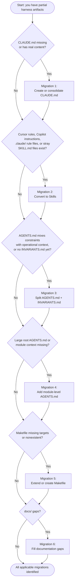
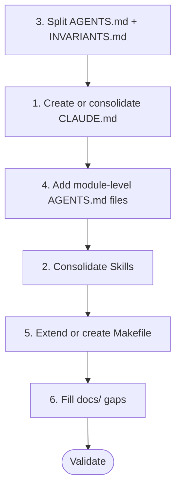

# Migrate Your Harness

This guide is for engineers who already have some harness artifacts in place — a `CLAUDE.md`, scattered Cursor rules, an ad-hoc `Makefile`, module notes — and want to converge on the full harness described in this series without throwing everything away and starting over.

**Prerequisites**: Read [Harness Components](04-Harness-Components.md) and [Build Your Harness](07-Build-Your-Harness.md) first. This guide assumes you know what a complete harness looks like and focuses on the delta from where you are now.

**Time to complete**: Varies by how scattered the existing artifacts are and how much content needs consolidating. Simpler migrations (just a CLAUDE.md shim) can be done quickly; full consolidation from multiple tool-specific locations takes proportionally longer.

> **Starting from scratch?** If your repository has no harness artifacts, [Build Your Harness](07-Build-Your-Harness.md) is the better conceptual starting point — this guide focuses on working with existing fragments. The `harness-setup` skill handles both starting points in a single flow.

> **Agentic execution**: Prompts in this guide assume an agentic environment (Claude Code, Cursor, GitHub Copilot, or similar tools with file access). The agent reads files directly — do not paste file contents. In a plain chat interface without file access, supply file contents where the prompt references a file.

> **Companion skill**: This chapter pairs with the [`harness-setup` skill](skills/harness-setup/SKILL.md). Every migration prompt referenced below lives in the skill's `references/` folder — invoke as `/harness-setup` in any agent supporting the [Agent Skills spec](https://agentskills.io/specification). Per [`INVARIANTS.md`](https://github.com/adobe/ai-repo-harness-guide/blob/main/INVARIANTS.md), prompts live only in the skill; this chapter is the conceptual companion.

---

**Before starting**: run the [before/after probe](09-Keep-It-Current.md#beforeafter-probe) from Keep It Current to record how your agent behaves before migration. Run it again after Phase 7 to see the difference.

---

- [Why Migration, Not a Rewrite](#why-migration-not-a-rewrite)
- [Why Canonical Locations Matter: Portability](#why-canonical-locations-matter-portability)
- [Phase 0: Assess — What Do You Have?](#phase-0-assess--what-do-you-have)
- [Migration Decision Tree](#migration-decision-tree)
- [Recommended Migration Order](#recommended-migration-order)
- [Migration 1: Create or Consolidate CLAUDE.md](#migration-1-create-or-consolidate-claudemd)
- [Migration 2: Consolidate Rules and Skills into .agents/skills/](#migration-2-consolidate-rules-and-skills-into-agentsskills)
- [Migration 3: Split AGENTS.md and INVARIANTS.md](#migration-3-split-agentsmd-and-invariantsmd)
- [Migration 4: Add Module-Level AGENTS.md Files](#migration-4-add-module-level-agentsmd-files)
- [Migration 5: Extend or Create the Makefile](#migration-5-extend-or-create-the-makefile)
- [Migration 6: Fill Documentation Gaps](#migration-6-fill-documentation-gaps)
- [Phase 7: Validate the Migration](#phase-7-validate-the-migration)
- [Common Migration Pitfalls](#common-migration-pitfalls)
- [Next Steps](#next-steps)

---

## Why Migration, Not a Rewrite

Existing files contain real constraints, footguns, and decisions — even if not yet structured correctly. Preserve them: move content to canonical locations, fill gaps, wire automation. Never delete an artifact before confirming its content has been migrated.

## Why Canonical Locations Matter: Portability

Many repositories already have agent guidance in place — but spread across tool-specific directories:

- `.claude/` — read by Claude only
- `.cursor/` — read by Cursor only
- `.github/copilot-instructions.md` or `.github/instructions/` — read by GitHub Copilot only

Guidance in those locations works, but only for the one tool that reads it. Switch tools or add a second AI assistant — and that guidance is invisible.

`AGENTS.md`, `INVARIANTS.md`, and `SKILL.md` under `.agents/skills/` are open standards ([agents.md](https://agents.md), [agentskills.io](https://agentskills.io/specification)) read by Cursor, Copilot, and any agent implementing the spec; Claude Code requires a minimal shim (see [Harness Components](04-Harness-Components.md)). Migration moves guidance from single-tool visibility to universal visibility.

---

## Phase 0: Assess — What Do You Have?

Before migrating anything, map out the current state. The assessment classifies every harness-related file you find against the canonical locations:

- Agent context → `AGENTS.md` (operational) and `INVARIANTS.md` (hard constraints)
- Skills → `.agents/skills/<skill-name>/SKILL.md`
- `CLAUDE.md` → Claude Code's entry point; shim only
- Everything else (`.claude/`, `.cursor/`, `.github/instructions/`, `.cursorrules`, etc.) → non-canonical; content must move, originals deleted

The prompt scans six categories — agent context files, skill/rule files, constraint files, documentation, execution surface, and `README.md` — and returns each item classified as ✅ complete, ⚠️ needs work, or ❌ missing, with the specific required action.

**Prompt**: [`.agents/skills/harness-setup/references/inventory.md`](skills/harness-setup/references/inventory.md). Use the output to identify which migrations below apply.

---

## Migration Decision Tree



Check each question independently — a "yes" means that migration applies to you. Once you know which apply, run them in the order shown in Recommended Migration Order below.

---

## Recommended Migration Order

If multiple migrations apply, this order minimizes rework:



Split `AGENTS.md` first (M3) — it establishes the canonical structure everything else references. Consolidate CLAUDE.md (M1) and module files (M4) once root is settled. Consolidate rules and skills (M2) once the operational split is stable, since skill descriptions reference `AGENTS.md`/`INVARIANTS.md` sections that need to exist first. Extend the Makefile (M5) before docs (M6) so doc prompts can reference working `make` targets.

> **Note**: The Phase 0 assessment output prioritizes migrations by impact (High/Medium/Low). The order above reflects *dependencies* — what must run before something else to avoid rework. Use the Phase 0 priorities to decide which migrations to tackle; use this sequence to handle dependencies correctly when multiple apply.

---

## Migration 1: Create or Consolidate CLAUDE.md

**Applies when**: `CLAUDE.md` doesn't exist, or exists with real content rather than just `@`-references.

**Target state**: `CLAUDE.md` contains only `@AGENTS.md` and `@INVARIANTS.md` references — nothing else. All real content lives in `AGENTS.md` and `INVARIANTS.md`.

The prompt handles three cases: (1) `CLAUDE.md` does not exist — create the shim; (2) `CLAUDE.md` is already a shim — report no-op; (3) `CLAUDE.md` has real content — classify each section (operational → `AGENTS.md`, constraints → `INVARIANTS.md`, duplicates → drop), produce the merged files, and reduce `CLAUDE.md` to the shim.

**Prompt**: [`.agents/skills/harness-setup/references/claude.md`](skills/harness-setup/references/claude.md).

**Expected output**:
- `CLAUDE.md` has 3–5 lines (header + `@`-references, nothing else)
- If content was migrated: every constraint from the old `CLAUDE.md` is findable in `AGENTS.md` or `INVARIANTS.md`; diff old vs. new `AGENTS.md` to confirm nothing was dropped

---

## Migration 2: Consolidate Rules and Skills into .agents/skills/

**Applies when**: You have any of the following:
- `.cursorrules` or files under `.cursor/rules/`
- `.github/copilot-instructions.md` or files under `.github/instructions/`
- Files under `.claude/` that function as instructions or skills
- `SKILL.md` files that exist outside `.agents/skills/`

**Target state**: Every skill lives under `.agents/skills/<skill-name>/SKILL.md`. `.agents/skills/` is the canonical, model-agnostic location — skills placed in tool-specific directories (`.github/`, `.cursor/`, `.claude/`) are invisible to other AI tools and will drift independently. Tool-specific files are removed once equivalent Skills exist in `.agents/skills/` — the one exception is a `.claude/skills/<name>` symlink pointing back to `.agents/skills/<name>`, which Claude Code needs to discover the canonical skill (it does not scan `.agents/skills/`).

### Step 1: Group Rules by Task Type

Reads all AI-tool-specific rule files identified in the Phase 0 assessment (`.cursorrules`, `.cursor/rules/`, `.github/copilot-instructions.md`, `.github/instructions/`, files under `.claude/`) and groups them into logical task types. For each group: a suggested skill name, which rules belong, and flags for content that should actually live in `AGENTS.md`/`INVARIANTS.md` or be discarded as model-specific quirks.

**Prompt**: [`.agents/skills/harness-setup/references/skills.md`](skills/harness-setup/references/skills.md) (Step 1 section).

### Step 2: Convert Each Group to a SKILL.md

Converts each rule group into a `.agents/skills/<skill-name>/SKILL.md` that follows the [Agent Skills spec](https://agentskills.io/specification). Keeps front matter minimal (loaded every invocation), references — not duplicates — `AGENTS.md`/`INVARIANTS.md`, and includes entry criteria, execution steps, and completion criteria.

**Prompt**: [`.agents/skills/harness-setup/references/skills.md`](skills/harness-setup/references/skills.md) (Step 2 section).

### Step 3: Delete Non-Canonical Files

Once all skill content is in `.agents/skills/`, delete every non-canonical file — whether it was the original definition or a shim.

| File | Action after consolidation |
|------|---------------------------|
| `.cursorrules` | Delete (or replace with a single comment pointing to `.agents/skills/` if the tool requires the file to exist) |
| `.cursor/rules/*.mdc` | Delete |
| `.github/copilot-instructions.md` | Delete |
| `.github/instructions/<name>.md` | Delete — do not update paths or keep as a shim |
| `.claude/skills/<name>/` (real content) | Move content to `.agents/skills/<name>/SKILL.md`, then replace with a symlink `.claude/skills/<name>` → `.agents/skills/<name>`. A symlink already pointing at `.agents/skills/` is correct — leave it |
| `.claude/commands/<name>.md` | Replace with a symlink `.claude/skills/<name>` → `.agents/skills/<name>`. Claude Code does not scan `.agents/skills/`; the symlinked skill is discovered directly, giving auto-invocation *and* `/name`. A command shim gives only manual `/name` and is the legacy surface |
| `SKILL.md` outside `.agents/skills/` | Delete after moving content to `.agents/skills/<skill-name>/SKILL.md` |

**Note on `applyTo` scope in `.github/instructions/` files**: These files often have frontmatter like `applyTo: "**/*.java"` that scopes them to specific file patterns. When migrating, capture that scope in the SKILL.md's `description` field (e.g., *"Use when working with Java files"*) or as an entry criterion in the instructions. Then delete the `.github/instructions/` file — a shim pointing from `.github/instructions/` into `.agents/` provides no benefit, since Copilot would need to follow the reference independently.

---

## Migration 3: Split AGENTS.md and INVARIANTS.md

**Applies when**: Your `AGENTS.md` contains hard, non-negotiable constraints mixed in with operational context — or you have no `INVARIANTS.md` at all.

**Target state**: `AGENTS.md` contains operational context only (roles, module context, footguns, decision links). `INVARIANTS.md` contains hard constraints (security rules, performance SLAs, compliance requirements, API contract rules). `AGENTS.md` links to `INVARIANTS.md` as canonical source.

The prompt classifies each section of the existing `AGENTS.md` as operational vs. constraint, produces the new operational-only `AGENTS.md` (within the line budget from [chapter 04: Progressive Discovery](04-Harness-Components.md#progressive-discovery-the-pattern-every-harness-file-follows), with a link to `INVARIANTS.md`), and produces `INVARIANTS.md` with each constraint formatted as `✅ <statement> — *Enforced by: <make target | human review | [not yet enforced]>*`, grouped by category (Security, Performance, Testing, Data Integrity, API Contract, Code Quality).

**Prompt**: [`.agents/skills/harness-setup/references/agents.md`](skills/harness-setup/references/agents.md) — "If AGENTS.md exists and mixes constraints with operational context — split" section.

### After Splitting

Update `CLAUDE.md` (if it exists) to reference both files:

```markdown
# Claude Code Extensions

@AGENTS.md
@INVARIANTS.md
```

---

## Migration 4: Add Module-Level AGENTS.md Files

**Applies when**: Your root `AGENTS.md` has grown large because it contains subdirectory-specific context, or you have subdirectories with security-sensitive code, API boundaries, or known quirks that aren't documented anywhere.

**Target state**: Root `AGENTS.md` stays within the line budget (see [chapter 04: Progressive Discovery](04-Harness-Components.md#progressive-discovery-the-pattern-every-harness-file-follows)) and covers only repository-wide context. Subdirectory-specific context lives in module-level `AGENTS.md` files under the relevant paths.

### Identifying Which Modules Need Their Own File

A subdirectory warrants its own `AGENTS.md` if it has security-sensitive or data-writing logic, owns API boundary responsibilities, contains legacy code with known quirks, contains significant amounts of code, has local rules that differ from or tighten root guidance, or currently carries context that should be local but lives in the root `AGENTS.md`.

The prompt enumerates qualifying subdirectories and reports for each: the path, why it qualifies, what to extract from root, and any additional local context derived from the actual code.

**Prompt**: [`.agents/skills/harness-setup/references/agents.md`](skills/harness-setup/references/agents.md) — "Module-Level AGENTS.md" section.

### Creating Each Module-Level File

For each identified subdirectory, use the prompt in [Build Your Harness — Section 2.2](07-Build-Your-Harness.md#22-create-module-level-harnesses-agentsmd-in-subdirectories).

After each module-level file is created:
1. Remove the extracted content from root `AGENTS.md`
2. Add a link from root `AGENTS.md` → module `AGENTS.md` in the Module Context section
3. Add a link from module `AGENTS.md` → root `AGENTS.md` in its Navigation section

---

## Migration 5: Extend or Create the Makefile

**Applies when**: Your `Makefile` is missing standard targets (`check`, `lint`, `typecheck`), or you have no `Makefile` and engineers run commands directly.

**Target state**: A `Makefile` that exposes all common commands through named targets, includes a `help` target, and has a `check` target that runs the complete validation suite.

### If No Makefile Exists

Use the prompt in [Build Your Harness — Section 2.4](07-Build-Your-Harness.md#24-create-makefile).

### If a Makefile Exists But Is Incomplete

The prompt extends an existing `Makefile` to include the standard harness targets (`test`, `lint`, `format`, `typecheck`, `check`, `help`) without renaming or removing existing targets — additive and backwards-compatible. Adds the agent guard comment at the top: `# Agents: run only make targets listed here. No direct shell commands.`

The prompt expects toolchain context: language, test framework, linter, formatter, type checker, spec validator. Fill those in before invoking.

**Prompt**: [`.agents/skills/harness-setup/references/makefile.md`](skills/harness-setup/references/makefile.md).

---

## Migration 6: Fill Documentation Gaps

**Applies when**: You are missing one or more files from the standard `docs/` structure.

**Target state**: `docs/` contains at minimum `ARCHITECTURE.md` and `DECISIONS.md`. `SETUP.md`, `TESTING.md`, and `CONTRIBUTING.md` are strongly recommended.

### Inventory First

Check which files exist:

```bash
ls docs/ 2>/dev/null || echo "no docs/ directory"
```

| File | Status | Action if missing |
|------|--------|-------------------|
| `docs/ARCHITECTURE.md` | | Use prompt in [07 §3.1](07-Build-Your-Harness.md#31-create-docsarchitecturemd) |
| `docs/DECISIONS.md` | | Use prompt in [07 §3.2](07-Build-Your-Harness.md#32-create-docsdecisionsmd) |
| `docs/SETUP.md` | | Use prompt in [07 §3.3](07-Build-Your-Harness.md#33-create-docssetupmd) |
| `docs/TESTING.md` | | Use prompt in [07 §3.4](07-Build-Your-Harness.md#34-create-docstestingmd) |
| `CONTRIBUTING.md` | | Use prompt in [07 §3.5](07-Build-Your-Harness.md#35-create-contributingmd) |

### Partial Docs: Filling Gaps in Existing Files

If a docs file exists but is incomplete, the prompt analyzes existing files plus the actual codebase to identify gaps and fill them. It enumerates the standard sections per file type — `ARCHITECTURE.md`, `DECISIONS.md`, `SETUP.md`, `TESTING.md`, `CONTRIBUTING.md` — and applies whichever apply to your repo.

Key rules: derive content from the repository (don't invent), reference `INVARIANTS.md` for constraint values rather than restating, mark anything uncertain as `[verify with team]`.

**Prompt**: [`.agents/skills/harness-setup/references/docs.md`](skills/harness-setup/references/docs.md).

---

## Phase 7: Validate the Migration

Run the [before/after probe](09-Keep-It-Current.md#beforeafter-probe) again now to compare against the baseline you recorded before Phase 0. The difference in agent behavior is the most direct measure of what the migration achieved.

After completing the applicable migrations, run the same validation prompts from [Build Your Harness — Phase 5](07-Build-Your-Harness.md#phase-5-validation---test-the-harness-end-to-end).

Additionally, run the migration-specific check, which validates ten dimensions: no orphaned content, no duplication, `CLAUDE.md` is a shim, `AGENTS.md` is operational-only, `INVARIANTS.md` is complete with `Enforced by:` annotations, skills are in the canonical location with originals deleted, any skills present are warranted and non-generic (skills are optional — none is a valid outcome), `Makefile` has required targets, cross-links are intact, and files are concise. Result is a per-dimension checklist (✅ / ⚠️ / ❌).

**Prompt**: [`.agents/skills/harness-setup/references/validation.md`](skills/harness-setup/references/validation.md).

Optionally, run the review panel to confirm content accuracy across structural documentation, operational documentation, harness usability, and token budget. Skip if no `docs/` files were migrated or created.

**Prompt**: [`.agents/skills/harness-setup/references/review-panel.md`](skills/harness-setup/references/review-panel.md)

### Validation Checklist

Use the checklist from [Build Your Harness — Validation Checklist](07-Build-Your-Harness.md#validation-checklist-is-your-harness-complete) as the target state. The migration is complete when all checklist items are ✅. If you ran the review panel, address any blocking issues before the next agent task.

---

## Common Migration Pitfalls

### Duplicating or losing content
Move content — don't copy it. Confirm it exists in the canonical location before deleting the original. Two copies of the same constraint will diverge; deleting before confirming loses it entirely. Use the Phase 0 assessment output as a migration checklist.

### Making AGENTS.md too large during consolidation
If `AGENTS.md` grows past the line budget (see [chapter 04: Progressive Discovery](04-Harness-Components.md#progressive-discovery-the-pattern-every-harness-file-follows)) while merging content, that's a signal to create module-level files earlier (Migration 4) rather than letting root grow.

### Skipping "Enforced by:" in INVARIANTS.md
Constraints without automation notes feel like suggestions. Mark every constraint with its enforcement status — even if the answer is `[not yet enforced]`. Those gaps are your automation backlog.

### Forgetting to update cross-links
After any migration: check that `README.md`, `CLAUDE.md`, root `AGENTS.md`, and module-level `AGENTS.md` files all have accurate links. Broken links are worse than no links.

---

## Next Steps

Once your migration is complete:

- **For new repositories**: use [Build Your Harness](07-Build-Your-Harness.md) as your starting playbook
- **For deeper layer coverage**: [Five Control Layers](03-Five-Control-Layers.md) covers Layers 4–5 (Tool & Permission Boundaries and Observability & Lifecycle Controls) in full — the file-level harness migrated here gives soft tool enforcement and engineering-time observability; chapter 03 covers the hard enforcement and runtime observability beyond what files alone can do
- **For reference architecture**: [Reference Layout](06-Reference-Layout.md) shows a complete production layout

The migration is never fully "done" — as your system evolves, keep `AGENTS.md`, `INVARIANTS.md`, and Skills up to date. A stale harness can be as costly as, or worse than, no harness — it actively misleads agents.

---

**← Previous:** [Build Your Harness](07-Build-Your-Harness.md) · **Next:** [Keep It Current](09-Keep-It-Current.md)
