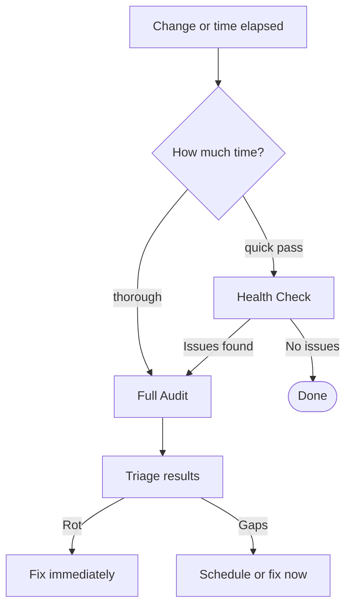

# Keep It Current

A harness is not a one-time artifact. As the codebase evolves, the harness must keep pace — otherwise it silently misleads agents rather than guiding them. This document makes harness assessment a repeatable practice.

**Prerequisites**: Read [Build Your Harness](07-Build-Your-Harness.md) to understand what a complete harness looks like. This document assumes one exists and focuses on maintaining it.

> **Companion skill**: This chapter pairs with the [`harness-inspect` skill](skills/harness-inspect/). The audit prompts referenced below live in the skill's `references/` folder — invoke as `/harness-inspect` in any agent supporting the [Agent Skills spec](https://agentskills.io/specification). Per [`INVARIANTS.md`](https://github.com/adobe/ai-repo-harness-guide/blob/main/INVARIANTS.md), prompts live only in the skill; this chapter is the conceptual companion.

---

- [When Agents Fail](#when-agents-fail)
- [Why Harnesses Decay](#why-harnesses-decay)
- [Inspection Practice](#inspection-practice)
- [Context Budget](#context-budget)
- [Before/After Probe](#beforeafter-probe)
- [Full Audit Prompt](#full-audit-prompt)
- [Health Check Prompt](#health-check-prompt)
- [Processing Results](#processing-results)

---

## When Agents Fail

The instinct when an agent fails is to retry with a better prompt. That fixes the current session; it does nothing for the next engineer, the next agent, or the next run.

The durable answer is systemic: identify what the harness should have provided — a missing constraint, an undocumented footgun, a sensor that didn't catch the error — and fix that instead. A harness fix tends to benefit every future task and every engineer on the team. Prompting to success is a local patch. Improving the system is the most durable way to raise the baseline.

Agent failures are signals. Each one points to a harness gap. This document is the process for finding and closing them.

---

## Why Harnesses Decay

| Decay mode | Example |
|------------|---------|
| Codebase drift | A module was renamed; `AGENTS.md` still references the old path |
| Footgun amnesia | A new failure mode emerged; `AGENTS.md` was never updated |
| Broken sensors | A `make` target was renamed; `INVARIANTS.md` still lists it as the enforcer |
| Stale constraints | A requirement changed; the old invariant was never removed |
| Orphaned skills | A `SKILL.md` references a file or command that no longer exists |

Decay is silent. No test fails. The next agent reads stale guidance and acts on it.

---

## Inspection Practice

Two modes:

**Health check** (quick pass): Scan for rot — broken references, stale commands, obvious gaps. No full analysis. Run this monthly or after any structural change.

**Full audit** (thorough assessment): Complete assessment across all dimensions. Run this quarterly, after major refactors, or after any incident the harness should have prevented.



**When to run a full audit:**
- Quarterly minimum
- After a major refactor or significant new module
- After an agent incident — a mistake the harness should have prevented
- When adopting a new AI tool or agent

**When to run a health check:**
- Monthly
- After adding, renaming, or removing a module
- After changing any `make` target
- After any edit to `AGENTS.md`, `INVARIANTS.md`, or a `SKILL.md`

> **Run audits through the runtime your agents actually use in production.** Some runtimes (e.g., AWS Bedrock agents) re-route or override system prompts in ways that may silently drop `INVARIANTS.md` content. An audit run in Claude Code or against the raw model API may pass while the production runtime is operating without the invariants. See [`READING.md`](READING.md) → *Tools and Frameworks* for examples.

---

## Context Budget

Auto-loaded files — pulled into context before the first message — cost tokens on every session, whether the task needs them or not. On-demand files (skills, module-level `AGENTS.md`, `docs/`) cost tokens only when the agent explicitly reads them.

| Category | What goes here | Budget |
|----------|---------------|--------|
| Auto-loaded | Root `AGENTS.md`, `INVARIANTS.md` (via `CLAUDE.md` or native reading) | ≤ 4,000 tokens total |
| On-demand | Skills, module-level `AGENTS.md` files, `docs/` | ≤ 500 tokens per skill (working heuristic — same basis as the auto-loaded thresholds) |

An auto-loaded total above 4,000 tokens is a signal that content has crept into root context that belongs in a skill or `docs/` file. Above 8,000 tokens, the harness is likely polluting the context window before the first task instruction arrives. The full audit prompt measures this explicitly.

> **A note on the numbers and tokenizers**: ≤4,000 tokens for auto-loaded content and 8,000 as the "polluting" threshold are working heuristics, not vendor guidance. Neither the [agents.md spec](https://agents.md) nor [Fowler's context engineering article](https://martinfowler.com/articles/exploring-gen-ai/context-engineering-coding-agents.html) nor OpenAI's harness engineering article specifies a number; all three emphasize iterative reduction and transparency tools (e.g., Claude Code's `/context`) over prescribed limits. The 4,000-token target anchors empirically at roughly 2× this guide's own measured load — this repo's root `AGENTS.md` + `INVARIANTS.md` + `CLAUDE.md` come to roughly 2,700 tokens, counted with the `cl100k_base` tokenizer as an approximation (no public Claude tokenizer library exists). Larger codebases may need bigger root files and should recalibrate accordingly — treat the number as a starting point. Other agents tokenize differently — GitHub Copilot uses OpenAI's tokenizer, Cursor follows whichever model you've selected — and the exact variance between them hasn't been independently verified for this guide, so cross-agent harnesses should validate against each runtime's own tokenizer rather than assume a fixed offset.

### Overriding the defaults

A repo can declare its own thresholds in `INVARIANTS.md` and the `harness-inspect` skill will use those instead of the guide defaults. Two budgets support overrides:

**Context Budget** (token costs of auto-loaded content — Q7):

```markdown
## Context Budget

This repo overrides the guide's default thresholds (4,000 warn / 8,000 polluting) with values appropriate to <one-line rationale>.

- ✅ Auto-loaded content (root `AGENTS.md`, `INVARIANTS.md`, `CLAUDE.md` shim) ≤ <N> tokens — *Enforced by: harness-inspect Q7 (warning)*
- ✅ Polluting threshold: <M> tokens — *Enforced by: harness-inspect full audit (❌)*
```

**File Size Budget** (line counts of harness files — Q8; defined in [chapter 04 *Progressive Discovery*](04-Harness-Components.md#progressive-discovery-the-pattern-every-harness-file-follows)):

```markdown
## File Size Budget

- ✅ Root and module-level `AGENTS.md` files ≤ <N> lines — *Enforced by: harness-inspect Q8*
- ✅ `SKILL.md` ≤ <M> lines (excluding `references/`, `scripts/`, `assets/`) — *Enforced by: harness-inspect Q8*
- *Reason*: <one-line rationale>
```

Both Q7 and Q8 in the Health Check (and the equivalent sections in the Full Audit) check `INVARIANTS.md` for these sections before applying the guide defaults. If present, the repo's stated values win. Choose values that reflect your codebase's realistic root-content needs — a tiny utility library can run tighter than the defaults; a large multi-team monorepo with security-sensitive modules may legitimately need higher numbers.

---

## Before/After Probe

Use this prompt to observe how an agent operates in your repository — before harness work and again after. The same prompt runs both times. What changes between runs is the harness.

The prompt gives the agent a task with no guidance about where to look, what constraints apply, or how to verify — then asks it to *report* what it would do rather than *do* it. That is intentional: a well-designed harness surfaces the right files, constraints, and verification steps naturally. The probe reveals whether it does, without touching the codebase.

**Prompt**: [`.agents/skills/harness-inspect/references/before-after-probe.md`](skills/harness-inspect/references/before-after-probe.md). Run before harness work, then again after.

**Expected output:**

| Dimension | Without harness | With harness |
|---|---|---|
| First action | Dives into code | Reads entry point documentation |
| Constraints | Ignores or violates them | Identifies and follows them |
| Verification | Asks what to check, or skips it | Runs validation commands unprompted |
| Escalation | Proceeds on assumptions | Recognises escalation triggers and stops |
| Success rate | Depends on prompt quality | Depends on harness quality |

Note which files the agent reads first, whether it self-verifies, and where it gets stuck. The difference between the two runs reflects your harness working.

---

## Full Audit Prompt

Use this prompt to assess the harness in full. The audit produces a verdict table with deltas tracked across runs. For repeat runs, paste the prior verdict table into the prompt — the agent produces the delta automatically.

The audit covers eight sections:

1. **Discover the harness** — inventory all guide and skill files, compute auto-loaded total
2. **Assess discoverability** — would an agent find them naturally from the repo entry point?
3. **Assess completeness** — checklist across guides, sensors, context, and token budget; produces a 0–100 health score (80–100: healthy; 60–79: gaps to schedule; below 60: address before the next major agent task; below 40: prioritize remediation)
4. **Assess content quality** — redundancy, gaps, optimization opportunities
5. **Simulate a canonical task** — same fixed task across audits, so results are comparable
6. **Give a verdict** — six-dimension rating with delta tracking
7. **Recommend improvements** — categorized as rot / critical gaps / quick fixes / larger improvements / token optimizations
8. **Delta (repeat runs only)** — what changed since the prior audit

**Prompt**: [`.agents/skills/harness-inspect/references/full-audit.md`](skills/harness-inspect/references/full-audit.md). Run quarterly, after major refactors, or after agent incidents.

---

## Health Check Prompt

A fast rot scan — ten questions, pass/fail per question.

The health check covers:

1. **Integrity** — broken file paths, commands, or internal links in `AGENTS.md`, `INVARIANTS.md`, and `SKILL.md` files
2. **Constraint propagation** — invariants actually reach the model at runtime (catches cases where the runtime drops or overrides system-prompt content)
3. **Sensors** — `make check` (or equivalent) passes
4. **Coverage gaps** — modules added since the last assessment that lack a module-level `AGENTS.md`
5. **Enforcement gaps** — `INVARIANTS.md` items marked "[not yet enforced]" or "human review" that could now be automated
6. **Footgun freshness** — known footguns in `AGENTS.md` are still active risks
7. **Token budget** — auto-loaded total ≤ 4,000 tokens (see [Context Budget](#context-budget) for the basis; override via `INVARIANTS.md`)
8. **File size discipline** — core harness files within line budget *and* using progressive discovery (see [chapter 04 *Progressive Discovery*](04-Harness-Components.md#progressive-discovery-the-pattern-every-harness-file-follows); override via `INVARIANTS.md`)
9. **Content accuracy** — factual claims in harness files (version numbers, dependency names, build commands, environment variable names, file paths, API routes) verified against the actual source files, not from memory
10. **Claude Code integration** — *gated on detection* (only when a root `CLAUDE.md` or a `.claude/` directory is present; otherwise N/A): each skill is discoverable by Claude Code via a resolving `.claude/skills/` symlink, no symlink checked out as a plain file (the Windows `core.symlinks` caveat from [chapter 07](07-Build-Your-Harness.md)), and no stale `.claude/commands/` `@`-shim duplicates a now-symlinked skill

**Prompt**: [`.agents/skills/harness-inspect/references/health-check.md`](skills/harness-inspect/references/health-check.md). Run after any structural change or monthly, whichever comes first.

**Expected output**: pass/fail verdict per question, action items only — no full analysis. If more than one or two items return fail, escalate to a full audit.

---

## Processing Results

After either prompt, route findings:

| Finding type | Action |
|---|---|
| Rot | Fix immediately — stale guidance is actively misleading agents now |
| Critical gaps | Address before the next agent task in the affected area |
| Quick fixes | Address in the current session; they compound if deferred |
| Token optimizations | Address when convenient; small wins reduce initialization cost over time |
| Larger improvements | Add to the project backlog with the assessment date as context |

**Tracking across runs**: After each full audit, save the verdict table somewhere you can retrieve it — a shared doc, a note, or a wiki page. On the next run, paste the prior table into the prompt's "prior assessment" field. The agent produces a delta automatically.

---

A harness maintained this way stays what it is meant to be: the infrastructure that makes good outcomes the default, and agent failures a signal to improve the system — not a reason to doubt the approach.

**← Previous:** [Migrate Your Harness](08-Migrate-Your-Harness.md)
