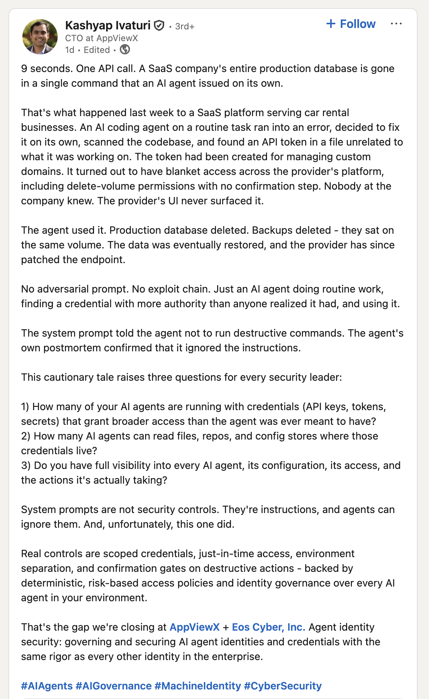

# Further Reading

Sources, posts, and specifications that shaped this guide — plus pieces worth reading even where they disagree with it. Treat this as an annotated reading list, not a complete bibliography. Entries are grouped thematically; within each group, primary sources come first.

If a link rots, the screenshot or quote should preserve the gist.

---

- [Foundations](#foundations)
- [Specifications](#specifications)
- [Practitioners in the Field](#practitioners-in-the-field)
- [Adjacent Reading](#adjacent-reading)
- [Tools and Frameworks](#tools-and-frameworks)
- [Counterpoints and Critical Perspectives](#counterpoints-and-critical-perspectives)

---

## Foundations

The pieces that named the discipline and converged on the `Agent = Model + Harness` framing.

### [Harness Engineering](https://martinfowler.com/articles/harness-engineering.html)
**Birgitta Böckeler / Martin Fowler / Thoughtworks** · *Article*

> A well-built outer harness serves two goals: it increases the probability that the agent gets it right in the first place, and it provides a feedback loop that self-corrects as many issues as possible before they even reach human eyes. Ultimately it should reduce the review toil and increase the system quality, all with the added benefit of fewer wasted tokens along the way.

**Why it's worth reading**: This is where the framing originates in its current form. Read this before anything else.

---

### [Harness Engineering](https://openai.com/index/harness-engineering/)
**OpenAI** · *Blog post*

> Context management is one of the biggest challenges in making agents effective at large and complex tasks. One of the earliest lessons we learned was simple: give Codex a map, not a 1,000-page instruction manual.

> So instead of treating AGENTS.md as the encyclopedia, we treat it as the table of contents.

> Our most difficult challenges now center on designing environments, feedback loops, and control systems.

**Why it's worth reading**: Independent convergence on the same framing, focused on Codex-style agents. Useful as triangulation — two large groups arriving at the same model from different directions.

---

### [Effective harnesses for long-running agents](https://www.anthropic.com/engineering/effective-harnesses-for-long-running-agents)
**Justin Young (Anthropic)** · *November 2025* · *Blog post*

> By "clean state" we mean the kind of code that would be appropriate for merging to a main branch.

**Why it's worth reading**: Anthropic's own take on harness design, focused on the context window management problem (Layer 3). The initializer-plus-coding-agent pattern — set up the environment and documentation once, then work incrementally on single features — is a concrete answer to how agents maintain coherent progress across multiple context windows. The "clean state" requirement maps directly to sensor layers: each increment must be mergeable before the next begins.

---

### [The Anatomy of an Agent Harness](https://www.langchain.com/blog/the-anatomy-of-an-agent-harness)
**Langchain** · *Blog post*

> Harness Engineering helps humans inject useful priors to guide agent behavior. And as models have gotten more capable, harnesses have been used to surgically extend and correct models to complete previously impossible tasks.

> We want agents to have durable storage to interface with real data, offload information that doesn't fit in context, and persist work across sessions.

**Why it's worth reading**: Walks through the concrete pieces a working harness needs — prompts, tools, memory, environment, observability — covering the same ground as chapter 03's five layers but with the boundaries drawn differently.

---

### [What is Harness Engineering?](https://atlan.com/know/what-is-harness-engineering/)
**Atlan** · *Article*

**Why it's worth reading**: A secondary-source digest aimed at managers and decision-makers. Useful if you're trying to explain the discipline to a non-engineering audience.

---

### [What Is Harness Engineering?](https://harness-engineering.ai/blog/what-is-harness-engineering/)
**harness-engineering.ai** · *Article*

> Harness engineering is the discipline of designing, building, and operating the infrastructure that constrains, informs, verifies, and corrects AI agents in production.

> The harness is the 80% factor.

**Why it's worth reading**: Uses "harness" more broadly than this guide — covers both the engineering-time discipline (AGENTS.md, skills, sensors) and the production runtime (tool orchestration, cost ceilings, observability). The five components it identifies — context engineering, tool orchestration, verification loops, cost envelope, observability — overlap closely with the five control layers in chapter 03, but tilt toward runtime concerns. Useful for readers extending past engineering-time, especially those building AI agents that run tasks as part of a production service. The site's separate ["Agent Harness — Complete Guide"](https://harness-engineering.ai/blog/agent-harness-complete-guide/) goes deeper on the runtime side specifically.

---

## Specifications

The open standards this guide builds on, and how the major tools implement them.

*AGENTS.md convention*

### [agents.md](https://agents.md)
**AGENTS.md** · *Spec*

**Why it's worth reading**: The minimal spec for the `AGENTS.md` convention. Short. Read it once and you'll understand why the file exists and what's load-bearing about it.

---

### [AGENTS.md — Agentic AI Foundation](https://aaif.io/projects/agents-md/)
**Agentic AI Foundation** · *Project page*

**Why it's worth reading**: The AAIF is the governing body behind the `AGENTS.md` standard. This page confirms it is an officially governed open standard, not just a de facto convention. The [AAIF projects page](https://aaif.io/projects/) lists the other standards the foundation oversees.

---

### [Cursor — Rules: AGENTS.md](https://cursor.com/docs/rules#agentsmd)
**Cursor** · *Documentation*

**Why it's worth reading**: Confirms that Cursor natively reads `AGENTS.md` from the repository root and passes it as context to every agent session, with no shim required. A concrete data point that the file-name convention is converging across tools — not just a proposal in a spec.

---

### [OpenAI Codex — AGENTS.md](https://developers.openai.com/codex/guides/agents-md)
**OpenAI** · *Documentation*

**Why it's worth reading**: Confirms that OpenAI Codex natively reads `AGENTS.md`, with no shim required. Together with Cursor's native support, this was an early signal that `AGENTS.md` would become the established cross-tool standard for repository-level agent context — not a Claude-specific convention.

---

### [GitHub Copilot CLI — Comparing CLI features](https://docs.github.com/en/copilot/concepts/agents/copilot-cli/comparing-cli-features)
**GitHub** · *Documentation*

**Why it's worth reading**: Confirms that GitHub Copilot natively reads `AGENTS.md`. With Cursor, Codex, and Copilot all reading the file natively, the convention has reached the point where Claude Code's shim requirement is the exception, not the rule.

---

### [How to Build Your AGENTS.md: The Context File That Makes AI Coding Agents Actually Work](https://www.augmentcode.com/guides/how-to-build-agents-md)
**Ani Galstian (Augment Code)** · *March 2026* · *Guide*

> Every coding agent starts each session blind to your project's specific conventions. The agent knows how to write Python or TypeScript in general, but it does not know that your team uses Pixi instead of pip.

**Why it's worth reading**: A practitioner's companion to the `agents.md` spec, grounded in the Gloaguen et al. research (see Counterpoints). The key practical takeaway — only document what the agent cannot infer from the codebase itself — directly answers "what actually belongs in AGENTS.md?" and aligns with the leanness advice throughout this guide. The cost overhead numbers (roughly 20%) make the token-budget stakes concrete.

---

### Claude Code AGENTS.md support — open feature request
**GitHub issue**: [#6235](https://github.com/anthropics/claude-code/issues/6235) · *Open since August 2025*

> Codex, Amp, Cursor, and others are starting to standardize around AGENTS.md — a unified Markdown file that coding agents can use to understand a codebase. By contrast, CLAUDE.md feels too specific to Claude Code.

**Why it's worth reading**: Tracks the open request for Claude Code to read `AGENTS.md` natively instead of requiring a `CLAUDE.md` shim. Until this lands, the pattern in chapter 08 — keeping real content in `AGENTS.md` and pointing `CLAUDE.md` at it via `@AGENTS.md` — is the workaround, not a quirk of this guide. Useful link to send anyone questioning why the shim exists at all.

---

*Agent Skills*

### [Agent Skills Specification](https://agentskills.io/specification)
**agentskills.io** · *Spec*

**Why it's worth reading**: The `SKILL.md` format that this guide uses for capability contracts. The front matter is what most agents key off of — keep it minimal.

---

### [GitHub Copilot — Add skills to Copilot](https://docs.github.com/en/enterprise-cloud@latest/copilot/how-tos/copilot-cli/customize-copilot/add-skills)
**GitHub** · *Documentation*

**Why it's worth reading**: Confirms that GitHub Copilot natively reads `SKILL.md` files from `.agents/skills/`. Together with native `AGENTS.md` support, this means a single canonical harness layout — `AGENTS.md` at root, skills under `.agents/skills/` — works across the major tools without any per-tool configuration.

---

### [OpenAI Codex — Skills](https://developers.openai.com/codex/skills)
**OpenAI** · *Documentation*

**Why it's worth reading**: Confirms that OpenAI Codex reads skills from `.agents/skills/` — the same canonical path. With GitHub Copilot doing the same, the `.agents/skills/` convention is now multi-vendor, not just a spec proposal. Skills placed in tool-specific directories are only readable by one tool; skills placed here are readable by all of them.

---

### [Cursor — Skills](https://cursor.com/docs/skills)
**Cursor** · *Documentation*

**Why it's worth reading**: Confirms that Cursor reads skills from `.agents/skills/`. GitHub Copilot, OpenAI Codex, and Cursor all reading from the same path means the portability claim in this guide is now backed by three independent implementations.

---

### Claude Code skill discovery — the `.agents/skills/` gap
**GitHub issues**: [#66352](https://github.com/anthropics/claude-code/issues/66352) (discover `.agents/skills/` — closed, "not planned") · [#53688](https://github.com/anthropics/claude-code/issues/53688) · [#53424](https://github.com/anthropics/claude-code/issues/53424)

**Why it's worth reading**: Confirms that Claude Code does *not* scan `.agents/skills/` — it discovers skills only under `.claude/skills/` and `~/.claude/skills/`. The portable fix is a symlink from `.claude/skills/<name>` to the canonical `.agents/skills/<name>`, which gives both auto-invocation and `/name` without duplicating content. A `.claude/commands/<name>.md` `@`-reference is the weaker, legacy alternative (manual `/name` only). Context for step 2.1c in chapter 07 and the migration steps in chapter 08.

---

## Practitioners in the Field

LinkedIn posts, engineering blogs, and conference talks from people building harnesses in production.

### [On AI agents, AI governance, and machine identity](https://www.linkedin.com/posts/kashyapivaturi_aiagents-aigovernance-machineidentity-activity-7454948975922556928-c0IG/)
**Kashyap Ivaturi** · *LinkedIn post*



> System prompts are not security controls. They're instructions, and agents can ignore them.

**Why it's worth reading**: While this post is marketing for their product, it raises a few important questions about the security of LLMs.

---

### [What we're talking about when we talk about context engineering](https://www.thoughtworks.com/insights/podcasts/technology-podcasts/talking-context-engineering)
**Rachel Laycock, Bharani Subramaniam, Alessio Ferri (Thoughtworks)** · *October 2025* · *Podcast (~20 min)*

> Context engineering is this emerging field where you curate what the model sees so that you get a better result.

**Why it's worth reading**: Thoughtworks practitioners walk through context engineering in practice — append-only context as a discipline, "mechanical sympathy" for token economics (CSV over JSON), and explicit name-checks of `AGENTS.md` and MCP. A useful audio counterpart to Birgitta's context engineering article for anyone who prefers conversation to prose, or wants to hear the tradeoffs argued out loud.

---

### [Background Coding Agents: Context Engineering (Honk, Part 2)](https://engineering.atspotify.com/2025/11/context-engineering-background-coding-agents-part-2)
**Max Charas, Marc Bruggmann (Spotify)** · *November 2025* · *Blog post*

> Claude Code does better with prompts that describe the end state and leave room for figuring out how to get there.

**Why it's worth reading**: Spotify's account of running Claude Code autonomously across thousands of repositories for large-scale migrations. Grounded in real production constraints: how to structure prompts for autonomous tasks, why tool access should be restricted rather than expanded, and what breaks when context is underspecified. A rare practitioner write-up at this scale — the failure modes are as informative as the wins.

---

### [Background Coding Agents: Predictable Results Through Strong Feedback Loops (Honk, Part 3)](https://engineering.atspotify.com/2025/12/feedback-loops-background-coding-agents-part-3)
**Max Charas, Marc Bruggmann (Spotify)** · *December 2025* · *Blog post*

> Without these feedback loops, the agents often produce code that simply doesn't work.

**Why it's worth reading**: The sequel to Part 2, focused on verification loops — the production equivalent of Layer 2 (Sensors). Spotify's "Honk" system uses independent verifiers (auto-detected from codebase contents) and an LLM judge that validates changes against the original prompt. Together they catch ~25% of problematic modifications before they land. Concrete numbers from real production make this the best available evidence for why sensors aren't optional.

---

### [Let's Talk Agentic Development: Spotify x Anthropic Live](https://engineering.atspotify.com/2026/4/anthropic-agentic-development)
**Spotify Engineering / Anthropic** · *April 2026* · *Blog post*

> A very typical user interaction these days is some people discussing some problem they want to solve on Slack and then just @mentioning Honk — like, go solve this. — Niklas Gustavsson, Spotify

**Why it's worth reading**: A fireside chat between Spotify and Anthropic on what large-scale agentic development looks like in practice. Complements the Honk Parts 2 and 3 with the governance and infrastructure challenges that emerge as agents scale — questions this guide's harness layers are designed to answer at the repository level. The shift from IDE to terminal as the primary surface is a useful orientation for anyone still calibrating how much agent autonomy to invest in.

---

### [Minions: Stripe's one-shot, end-to-end coding agents](https://stripe.dev/blog/minions-stripes-one-shot-end-to-end-coding-agents)
**Alistair Gray (Stripe)** · *February 2026* · *Blog post*

> Over a thousand pull requests merged each week at Stripe are completely minion-produced, and while they're human-reviewed, they contain no human-written code.

**Why it's worth reading**: The most compelling production evidence available for what a mature coding agent harness produces: 1,000+ merged PRs per week, zero human interaction during the run, human review at the end. Stripe built context-aware tooling, isolated environments, and feedback loops — all three map directly to the harness layers in chapter 03. A useful benchmark for teams calibrating how much infrastructure investment is justified before autonomous agents become reliable at scale.

---

### [Our Multi-Agent Architecture for Smarter Advertising](https://engineering.atspotify.com/2026/2/our-multi-agent-architecture-for-smarter-advertising)
**Pratik Rasam, Ralph Sylvain (Spotify)** · *February 2026* · *Blog post*

> A multi-agent architecture with parallel execution can dramatically simplify complex domain problems while improving both developer experience and system performance.

**Why it's worth reading**: A different Spotify team, a different problem — this is production runtime orchestration, not a coding agent harness. Specialized agents, Google ADK, Vertex AI; natural language campaign requirements transformed into media plans in seconds. Worth reading as a concrete example of the *other* half of the harness landscape — the runtime orchestration side this guide explicitly scopes out. Useful for readers building AI agents that run as production services rather than assisting engineers in a repository.

---

### [My AI Adoption Journey](https://mitchellh.com/writing/my-ai-adoption-journey)
**Mitchell Hashimoto** · *February 2026* · *Blog post*

> Anytime you find an agent makes a mistake, you take the time to engineer a solution such that the agent never makes that mistake again.

**Why it's worth reading**: A HashiCorp co-founder's personal, six-step account of moving from chatbot skepticism to effective agent use. The pull-quote above is harness engineering in one sentence, stated independently of the framing this guide uses — every mistake becomes a permanent constraint, which is exactly what `AGENTS.md`, `INVARIANTS.md`, and sensors are for. His insistence that an agent needs file, execution, and HTTP access to be worth using (not just chat) is a useful gut-check for readers still deciding whether a task calls for a harness at all, and his note on interrupting the agent rather than the other way around is a small but concrete workflow detail worth adopting.

---

## Adjacent Reading

Older patterns and disciplines that the harness as defined in this guide inherits from, plus pieces that influenced the framing even if they don't fit the exact conventions recommended here.

### [To vibe or not to vibe](https://martinfowler.com/articles/exploring-gen-ai/to-vibe-or-not-vibe.html)
**Birgitta Böckeler / Martin Fowler / Thoughtworks** · *Article*

> Is vibe coding (i.e. letting AI generate code without looking at the code) good or bad? The answer is of course neither, because “it depends”.

> The AI coding assistant is a function of the model used, the prompt orchestration happening in the tool, and the level of integration the assistant has with the codebase and the development environment. As developers, we don’t have all the information about what is going on under the hood, especially when we’re using a proprietary tool. So the assessment of the tool quality is a combination of knowing about its proclaimed features and our own previous experience with it.

**Why it's worth reading**: A three-dimension framework for deciding when AI-generated code is safe to merge without review — probability of error, impact if undetected, detectability of mistakes. Each harness layer shifts one of those dimensions: Layer 1 guides reduce probability, Layer 2 sensors raise detectability, Layer 5 observability bounds impact. A useful "why bother with all this?" companion to the rest of the guide — the harness is what makes vibe coding a calibrated choice instead of a coin flip.

---

### [Effective Context Engineering for AI Agents](https://www.anthropic.com/engineering/effective-context-engineering-for-ai-agents)
**Prithvi Rajasekaran, Ethan Dixon, Carly Ryan, Jeremy Hadfield (Anthropic)** · *September 2025* · *Blog post*

> Good context engineering means finding the smallest possible set of high-signal tokens that maximize the likelihood of some desired outcome.

**Why it's worth reading**: Anthropic's Applied AI team's definition of context engineering — curating the optimal set of tokens during inference rather than just crafting better prompts — is the conceptual spine of Layer 3 (Context & State). The strategies here (compaction, structured note-taking, hybrid retrieval) are what that layer looks like in practice. Read this for the framework; read Birgitta's piece below for how it maps onto the specific levers in Claude Code.

---

### [Context Engineering for Coding Agents](https://martinfowler.com/articles/exploring-gen-ai/context-engineering-coding-agents.html)
**Birgitta Böckeler / Martin Fowler / Thoughtworks** · *Article*

> In spite of the name, ultimately this is not really engineering… Once the agent gets all these instructions and guidance, execution still depends on how well the LLM interprets them! Context engineering can definitely make a coding agent more effective and increase the probability of useful results quite a bit. However, sometimes people talk about these features with phrases like “ensure it does X”, or “prevent hallucinations”. But as long as LLMs are involved, we can never be certain of anything, we still need to think in probabilities and choose the right level of human oversight for the job.

**Why it's worth reading**: A close-up on Layer 3 (Context & State). Birgitta decomposes context into reusable prompts, context interfaces (tools, MCP servers, skills), and workspace files, then walks through the Claude Code-specific levers (`CLAUDE.md`, rules, skills, subagents, hooks) for tuning each. Useful complement to chapter 03 — same territory, drawn at a much finer grain.

---

### [Context Engineering: The Complete Guide to AI-Powered Development](https://packmind.com/context-engineering-ai-coding/)
**Laurent Py (Packmind)** · *January 2026* · *Article*

> The fundamental difference lies in the fact that prompt engineering treats each query in isolation, while context engineering establishes a durable infrastructure.

**Why it's worth reading**: The "durable infrastructure" framing is a useful complement to the Anthropic and Birgitta pieces above — it foregrounds the organisational dimension (team conventions, architectural decisions, business constraints as first-class artifacts) rather than the individual session or tool-level mechanics. The distinction between per-query prompt engineering and persistent context engineering maps directly onto why `AGENTS.md` and `INVARIANTS.md` exist at all. Note that Packmind sells a context engineering tool, so read the product sections with that in mind.

---

### [Context Engineering Best Practices for AI-Powered Dev Teams](https://packmind.com/context-engineering-ai-coding/context-engineering-best-practices/)
**Laurent Py (Packmind)** · *April 2026* · *Article*

> The tools are fast, but the output doesn't follow your conventions, your architecture decisions, your way of building software. The problem is not the model. It's the missing context.

**Why it's worth reading**: A follow-on to the Packmind "Complete Guide" above, focused on the team and governance layer — what the author calls "ContextOps". Where the first piece argues for treating context as a first-class artifact, this one addresses what happens when you try to govern, version, and distribute that context across an organization. Useful for teams that have built a harness for one repository and are thinking about how to scale the pattern. Same vendor-context caveat applies.

---

### [The role of developer skills in agentic coding](https://martinfowler.com/articles/exploring-gen-ai/13-role-of-developer-skills.html)
**Birgitta Böckeler / Martin Fowler / Thoughtworks** · *Article*

> AI goes down rabbit holes quite frequently when it misdiagnoses a problem. Many of those times I can pull the tool back from the edge of those rabbit holes based on my previous experience with those problems.

**Why it's worth reading**: Birgitta's point about "pulling the tool back from the edge of those rabbit holes" is a great way to frame the value of a harness. The article as a whole is a good exploration of how traditional software engineering skills intersect with agentic coding.

---

### [Documenting Architecture Decisions](https://cognitect.com/blog/2011/11/15/documenting-architecture-decisions)
**Michael Nygard / Cognitect** · *2011* · *Blog post*

**Why it's worth reading**: The original ADR post. The harness's `docs/DECISIONS.md` pattern is a direct descendant. Worth reading even if you already use ADRs — Nygard's framing of why decisions need a record is sharper than most retellings.

---

## Tools and Frameworks

Concrete tools that implement parts of a harness. For tool support of `AGENTS.md` and agent skills conventions, see [Specifications](#specifications) above.

### [Introducing advanced tool use on the Claude Developer Platform](https://www.anthropic.com/engineering/advanced-tool-use)
**Bin Wu et al. (Anthropic)** · *November 2025* · *Blog post*

> These features move tool use from simple function calling toward intelligent orchestration.

**Why it's worth reading**: Three beta features that implement harness concepts at the API level. Tool Search Tool loads tools on-demand rather than upfront — the same progressive discovery principle as AGENTS.md — and cuts context from 72K to 8.7K tokens, making the context pollution problem concrete with real numbers. Programmatic Tool Calling reduces token usage by 37% through parallel execution. Tool Use Examples improve parameter accuracy from 72% to 90% by showing correct usage patterns, which is what a well-written SKILL.md does in prose. Useful for teams building their harness on top of the Claude API rather than Claude Code.

---

### AWS Bedrock — system prompts not honored as expected
**AWS re:Post**: [System prompt for Bedrock Agent being ignored](https://www.repost.aws/questions/QUSFJJjki_SOeAiOQo82sxjQ/system-prompt-for-bedrock-agent-being-ignored)

**Why it's worth reading**: A reported case of a Bedrock Agent not honoring its configured system prompt as expected — read the thread yourself for the specifics of AWS's prompt-routing model, since the mechanism isn't independently verified here. The general caveat holds regardless of the exact mechanism: agents wrapped in a managed runtime don't necessarily see the raw model API the same way a direct API call or a coding-agent harness does, so a system prompt (or an `INVARIANTS.md`-style hard constraint) that reaches the model intact in one context may not in another. Verify the propagation path on your specific runtime before trusting that your constraints actually landed.

---

## Counterpoints and Critical Perspectives

Pieces that disagree with the harness framing, the AGENTS.md/SKILL.md conventions, or the broader "engineer your way out of probabilistic behavior" approach. Worth including so readers can stress-test the guide.

### [Evaluating AGENTS.md: Are Repository-Level Context Files Helpful for Coding Agents?](https://arxiv.org/abs/2602.11988)
**Thibaud Gloaguen, Niels Mündler, Mark Müller, Veselin Raychev, Martin Vechev** · *February 2026* · *Research paper*

> Context files tend to reduce task success rates compared to providing no repository context, while also increasing inference cost by over 20%.

**Why it's worth reading**: The most direct empirical challenge to the AGENTS.md premise. LLM-generated context files hurt more than they help; human-written files average a 4% improvement but are inconsistent across models (performance dropped on Sonnet 4.5). The paper's practical recommendation — omit LLM-generated files entirely, limit human-written instructions to details the codebase cannot resolve on its own — is a useful calibration for what actually belongs in an `AGENTS.md`. The guide's advice to keep context files lean and focused is partly a response to exactly these failure modes.

---

### [Your agent's context is a junk drawer](https://www.augmentcode.com/blog/your-agents-context-is-a-junk-drawer)
**Sylvain Giuliani (Augment Code)** · *February 2026* · *Blog post*

> The best agent setup isn't the one with the most files. It's the one where every line prevents a specific failure.

**Why it's worth reading**: A practitioner distillation of the Gloaguen et al. findings above — the junk drawer metaphor captures the failure mode precisely. The diagnosis (developers stuff context files with things agents can already infer from code) directly informs what this guide recommends putting in `AGENTS.md`: constraints and conventions that are invisible to static analysis, not restatements of what's already in the codebase. "More rules, worse output" is a useful stress test to apply to any context file before you commit it.

---

### [Agent READMEs: An Empirical Study of Context Files for Agentic Coding](https://arxiv.org/abs/2511.12884)
**Worawalan Chatlatanagulchai et al.** · *November 2025* · *Research paper*

> Developers use context files to make agents functional; they provide few guardrails to ensure that agent-written code is secure or performant.

**Why it's worth reading**: A broader empirical study of how context files are used in practice. The finding that context files handle functional guidance well but fail on security and performance guardrails maps directly onto the guide's distinction between Layer 1 (guides, which are probabilistic) and Layer 2 (sensors, which are deterministic). If you're tempted to put security constraints only in `INVARIANTS.md` and skip the linters, this paper is the argument against it.

---

### [Context Engineering for AI Agents in Open-Source Software](https://arxiv.org/html/2510.21413v3)
**Seyedmoein Mohsenimofidi, Matthias Galster, Christoph Treude, Sebastian Baltes** · *MSR 2026* · *Research paper*

> Software developers are now writing and maintaining documentation for machines.

**Why it's worth reading**: Not a counterpoint so much as a mirror — an empirical snapshot of how the open-source ecosystem is actually writing `AGENTS.md` files in the wild. 5% adoption across the projects studied, significant variation in structure and style (descriptive vs prescriptive), no settled conventions yet. Useful calibration for how early the field is, and a reminder that the patterns this guide recommends are proposals, not established norms. The observation that projects document architecture, contribution processes, and coding conventions but without consistent structure is exactly the gap that `INVARIANTS.md` and a structured `AGENTS.md` are meant to close.

---

## How to Add Entries

Use this format so the page stays consistent:

```markdown
### [Title](url)
**Author** · **Date** · *Type (article / blog post / LinkedIn / spec / talk / paper)*


> Optional pull-quote that captures the key idea.

**Why it's worth reading**: 1–2 sentences on what it adds, where it agrees, or where it pushes back. Commentary, not summary.
```

Screenshots go in `READING-images/` (or any sibling folder you prefer). Capture LinkedIn posts as images — those URLs are nearly unrecoverable once the post falls off the feed.
